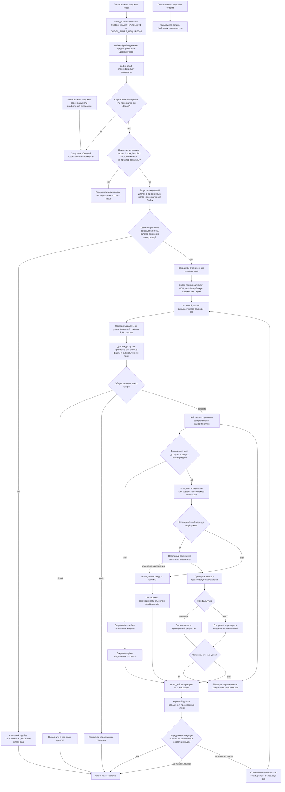
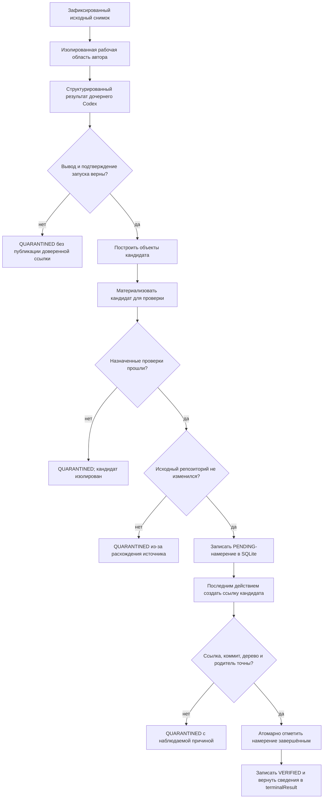
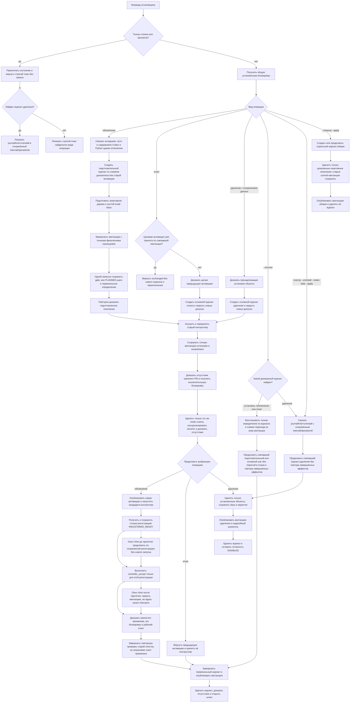
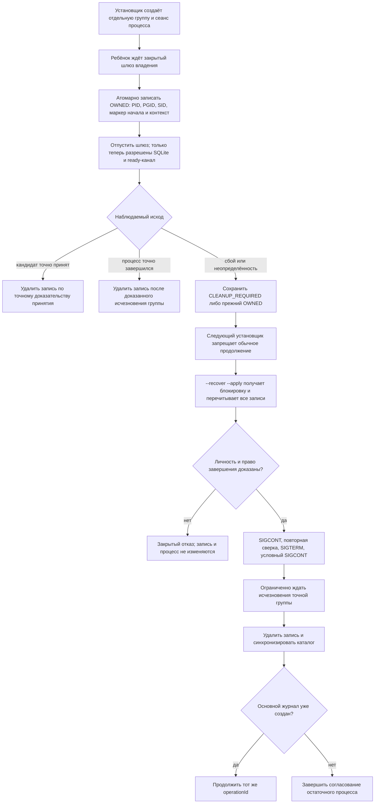
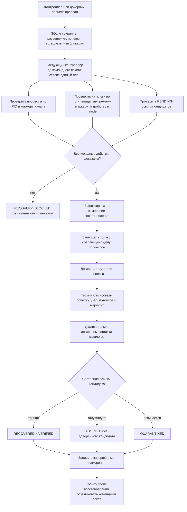

# Как работает адаптивный запуск субагентов версии 2

Этот документ показывает путь от запуска Codex до результата подзадачи и
отдельно разбирает публикацию пишущего результата, жизненный цикл установки и
восстановление после прерывания. Команды оператора находятся в
[операционной инструкции](../runbooks/adaptive-subagents-v2-operations.md), а
правила выбора моделей — в
[README расширения](../../plugins/codex-smart-subagents/README.md#как-выбираются-модель-и-уровень-рассуждения).
Схемы фиксируют предусмотренный договор поведения, а не заменяют живую
проверку. Результаты живой проверки опубликованы в
[итоговом отчёте](2026-07-20-adaptive-subagents-v2-validation.md).

## Полный поток запроса



Управляемая команда `codex` задаёт модель корневого координатора только при
запуске нового диалога. В середине существующего диалога корневая модель не
меняется. Адаптивность достигается тем, что делегированный узел становится
новым процессом с собственной точной парой «модель — уровень рассуждения».
`codex-native`, `codexs`, `codexro`, `codexwide` и `codexfa` всегда идут
нативной ветвью. `codexfd` ограничен диагностикой. `codex help` и
`codex update` обходят контроллер, но текст после разделителя остаётся
запросом: `codex -- help` и `codex -- update` попадают в управляемый путь.
Если обязательный управляемый запуск не может доказать контур, он завершается
кодом 69 без скрытого перехода. Уже открытый разговор нельзя перевести в этот
режим задним числом.

До первого хода и первого инструментального вызова проверяются три независимых
основания адаптивного режима. Первое — неизменяемый `.mcp.json` установленного расширения с точным
набором четырёх инструментов, обязательным запуском и режимом подтверждения
`approve`. Второе — смыслово неизменившаяся пользовательская политика Codex: она не
выключает расширение или сервер, не фильтрует инструменты, не ослабляет режим
подтверждения и не подменяет сервер одноимённой записью. Третье — живая
аттестация именно bundled MCP, созданная из фактического ответа `tools/list` и
связанная с одноразовым nonce, активацией, шлюзом, процессом и полным
отпечатком описаний инструментов.

Codex запускает MCP лениво, поэтому `UserPromptSubmit` не требует живую
аттестацию до первого `tools/list`: он повторно проверяет смысловую политику,
встроенный договор и живой контроллер, затем сохраняет контекст. MCP при
фактическом запуске сам проверяет ту же политику, публикует аттестацию и только
после этого принимает `smart_plan`. Несвязанная перезапись `config.toml`,
например запись доверия обработчикам, не считается изменением целевой
политики. `Stop` повторно проверяет эту целевую политику и долговечное состояние
хода. При невозможности создать план он выдаёт не более двух повторных
указаний, после чего разрешает завершение; бесконечного цикла нет.

`smart_plan` принимает закрытый граф: каждый узел содержит `clientNodeId`,
`dependencyIds` и отдельный `routingInput`. В одном маршруте допускается до 20
узлов, 60 связей и глубина 4. Если есть пишущий узел, он единственный,
находится в конце графа и зависит прямо либо косвенно от всех читающих узлов.
Модель и уровень рассуждения выбираются независимо для каждого узла.
Публичный `routingInput` ограничен смысловыми `taskFacts`, `contextBundle` и
`roleTemplateId`; служебные поля контроллер добавляет сам перед единственной
проверкой маршрутизатором.

Граф не запускается частично при смешанных решениях. Наличие хотя бы одного
`clarify` делает весь маршрут уточняющим; сочетание `direct` и `delegate`
делает весь маршрут обычным. Выполнение начинается только когда каждый узел
получил `delegate`. Результаты успешных зависимостей передаются потомку в
ограниченной проекции с отпечатками. Отказ узла закрывает ещё не запущенных
потомков.

Четвёртый инструмент умного хода, `smart_cancel`, отменяет незавершённый
запуск повторяемо по `startRequestId`. Причина `USER_REQUESTED` означает явную
отмену пользователем, `TURN_ENDED` — завершение связанного хода, а
`ROUTE_SUPERSEDED` — замену маршрута. Это не административная команда
`cancel`: административный интерфейс версии 2 её не предоставляет.

## Поток пишущего результата



Кандидат находится в отдельном карантинном репозитории Git. `VERIFIED`
означает, что контроллер доказал ссылку и проверки, но не означает применение
к исходной рабочей копии. Пользователь либо следующий явный процесс отдельно
решает, что делать с кандидатом.

`CANDIDATE_READY` остаётся допустимым в полном договоре состояний и при
переносе ранее сохранённых записей. В текущем производственном пути успешная
попытка пишущего узла имеет состояние `SUCCEEDED`, а публикация кандидата
отдельно получает `VERIFIED`.

## Обновление, откат и удаление установки



Повтор той же завершённой операции возвращает `unchanged`. До терминальной
квитанции шлюз остаётся закрытым, но нативный Codex не блокируется. Обновление
не подменяет точную модель уже начатого корневого диалога; новая активация
действует для последующих запусков.

Прерванное удаление с сохранением данных можно продолжить двумя входами в одну
операцию. Повтор `--uninstall --retain-data --apply --json` использует
существующий журнал. Общий `--recover --preview --json` распознаёт этот журнал и
показывает `extensions.lifecycleAdapter.journalKind=uninstall` вместе с
сохранённым `extensions.lifecycleAdapter.internalOperationId`; верхнее поле
`operationId` при просмотре остаётся пустым. `--recover --apply --json`
продолжает тот же `operationId`. Прерванная уборка остаётся отдельной: она
продолжается только повтором `--cleanup --apply --json`.

`REGISTERED_READY` ещё не делает кандидата принятым контроллером. Точная
регистрация сохраняется в журнале, после чего `controller_accept` должен
принять именно её. Только затем проверяются личность преемника, его
исключительная блокировка и рабочий сокет. Повторная проверка старого шага
остановки или очистки распознаёт уже принятого преемника и не требует удалить
его новый сокет либо повторно получить удерживаемую им блокировку.

Есть два разных окна прерывания:

- после `REGISTERED_READY`, но до `controller_accept` восстановление читает
  сохранённую точную регистрацию и продолжает принятие без повторного запуска
  кандидата;
- после фиксации принятия, но до отметки шага журнала восстановление сверяет
  квитанцию принятия и уже принятого преемника. Оно не ждёт повторно закрытый
  канал готовности и не посылает вторую команду принятия.

## Восстановление временного процесса установщика

Установщик не считает один номер процесса достаточным доказательством
владения. До того как дочерний процесс получит доступ к SQLite или каналу
готовности, родитель сохраняет частную каноническую запись с проверяемой
целостностью: PID, группу и сеанс процесса, маркер его начала и контекст
операции. При необходимости `OWNED` атомарно заменяется на
`CLEANUP_REQUIRED`. Обычное продолжение заблокировано, пока запись не
разрешена.



Сигнал `SIGKILL` в этом пути не используется. До каждого сигнала заново
сверяются PID, группа, сеанс и маркер начала. Если кандидат уже мог быть
принят, отдельное положительное разрешение на его завершение обязательно;
неизвестное состояние не трактуется как разрешение. Уже исчезнувшая точная
группа может быть разрешена без сигнала. Файловая блокировка,
проверки личности, ожидание и SQLite используют остаток единого срока
корневой операции, поэтому повтор не образует бесконечное ожидание.

Запись хранится в
`install-manifests/transient-process-ownership-v2/LEASE_ID.json`. Состояние
`OWNED` означает действующее владение, а `CLEANUP_REQUIRED` — сохранённую
обязанность точной уборки. Операторский порядок и коды отказов приведены в
[операционной инструкции](../runbooks/adaptive-subagents-v2-operations.md#восстановление-временных-процессов-установщика).
Читающие команды выводят только `leaseId`, состояние и вид контекста в
`extensions.durableProcessOwnership`; секрет запуска в публичную проекцию не
попадает.

## Восстановление установщика после прерывания

Этой схемой управляет установщик. Для прерванной установки, обновления, отката
или удаления просмотр незавершённого журнала и применение только совпавшего
плана выглядят так:

```bash
python3 scripts/install_adaptive_subagents.py --recover --preview --json
python3 scripts/install_adaptive_subagents.py --recover --apply --json
```

При журнале удаления пробный результат содержит
`extensions.lifecycleAdapter.journalKind=uninstall` и сохранённый
`extensions.lifecycleAdapter.internalOperationId`; верхнее поле `operationId`
при просмотре остаётся пустым. Применение продолжает тот же `operationId`.
Второй точный вход в тот же журнал — повтор команды удаления:

```bash
python3 scripts/install_adaptive_subagents.py --uninstall --retain-data --apply --json
```

Прерванная уборка не входит в общий путь `--recover` и продолжается повтором
своей команды:

```bash
python3 scripts/install_adaptive_subagents.py --cleanup --apply --json
```

Эти команды не следует смешивать с восстановлением маршрута через
административную оболочку, показанным ниже.

## Восстановление маршрута после прерывания

Этот раздел относится только к маршруту, дочерним процессам, временным
областям и кандидатам Git. Он не продолжает журнал установки, обновления,
отката или удаления из предыдущего раздела и не заменяет повтор отдельной
команды уборки.



Основное правило восстановления — сначала доказательство, затем изменение.
Для маршрутов пробный план строит административная оболочка:

```bash
~/.local/bin/codex-smart-subagents-admin recover --dry-run
```

Его применение через `recover --apply` допускается только при остановленном
контроллере, повторно проверяет состояние под
исключительной блокировкой и применяет единый план для разрешений запуска,
попыток, временных областей и публикаций кандидатов. Все области проверяются
до первых изменений этого применения. Это начальная проверка всего плана, а
не обещание общей транзакции между SQLite, процессами, файловой системой и
Git: каждое внешнее действие поэтому окружено заранее записанным намерением и
повторной проверкой.

Штатный операторский порядок:

```bash
~/.local/bin/codex-smart-subagents-admin stop
~/.local/bin/codex-smart-subagents-admin recover --dry-run
~/.local/bin/codex-smart-subagents-admin recover --apply
```

`stop` дважды проверяет точный PID и маркер начала принятого контроллера,
посылает сигнал только ему и доказывает исчезновение. Повторная остановка уже
отсутствующего контроллера безопасна. Неизвестный объект не удаляется, чужой
PID не получает сигнал, а кандидат Git никогда не применяется, не сливается
и не отправляется автоматически.

## Как читать результат

Для обычного ответа достаточно итогового сообщения корневого диалога.
`routeId` возвращают `smart_plan` и последующие результаты умного хода;
агрегатная команда `status` перечисляет счётчики, но не служит списком
идентификаторов маршрутов. Для проверки конкретного маршрута взять его
`routeId` из результата и выполнить:

```bash
~/.local/bin/codex-smart-subagents-admin inspect ROUTE_ID --limit 100
```

`inspect` показывает состояние маршрута, узлы, попытки, события, временные
области и кандидаты. Поля каждого узла `model` и `reasoningEffort` показывают
выбранную для него пару. `inspect` не возвращает зависимости графа: их нужно
сохранить из `smart_plan`, а порядок допуска сверять по событиям. Поле
`terminalResult` возвращает `smart_wait`, а не административная команда.
Раздел `candidates` показывает, создан ли
пишущий кандидат и считается ли он доверенным. Даже `VERIFIED` означает лишь
доказанный кандидат: команда не применяет его, не сливает и не отправляет во
внешний репозиторий автоматически. Полное содержимое пользовательской задачи
административная проекция не возвращает.

## Границы обещания

- `AGENTS.md` может запросить встроенное делегирование и динамический выбор
  пары, но не гарантирует принятую здесь смысловую шкалу, закрытый отказ и
  проверку фактического запуска.
- Повседневный управляемый вход — свежий `codex`; `codex-smart` остаётся
  диагностической оболочкой.
- Модель корневого диалога не переключается посреди хода.
- Отсутствующая Luna, Terra или Sol не заменяется другой моделью молча.
- Смешанный граф `direct`/`delegate` не исполняется частично.
- Итог маршрута возвращает проверенный результат, но не применяет пишущий
  кандидат.
- Восстановление не угадывает происхождение неизвестного файла или каталога.
