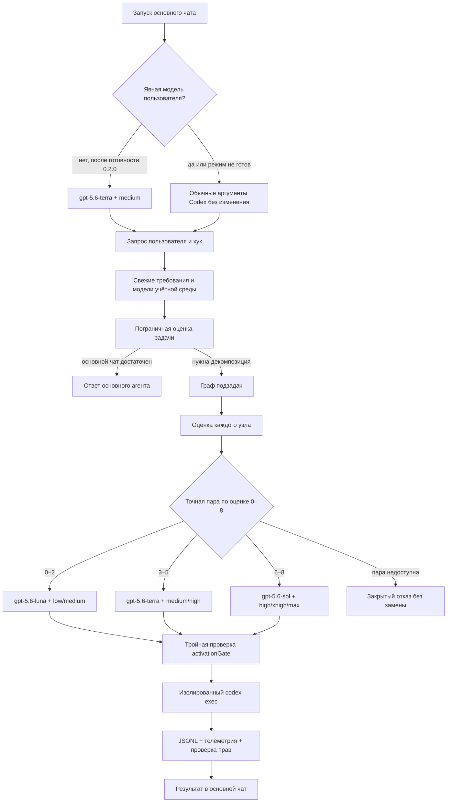
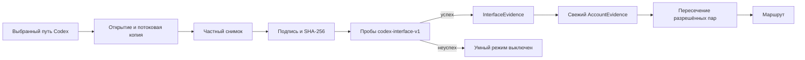
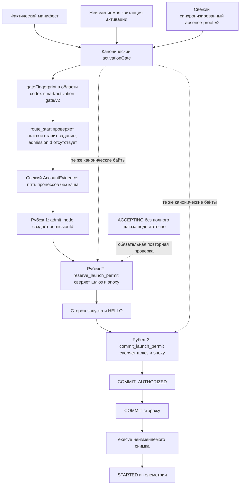
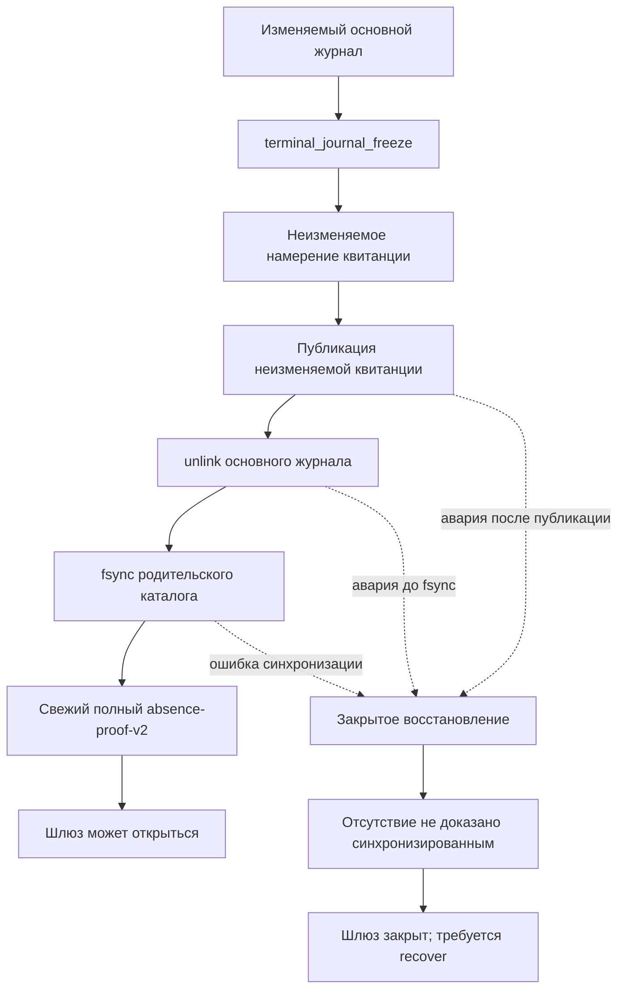
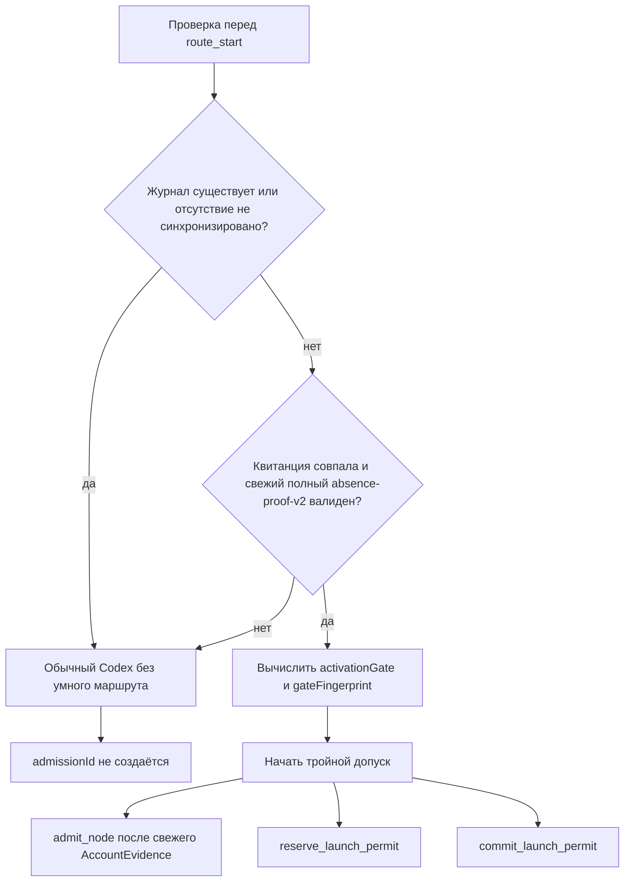

# Исторический план: совместимость Codex и идемпотентный жизненный цикл

> **Исторический документ.** Это снимок проектирования и состояния работ на
> 17–19 июля 2026 года, а не текущая инструкция и не доказательство готовности
> выпуска. Формулировки «ещё не реализовано», версии и промежуточные статусы
> ниже сохранены для истории решения и могут не соответствовать текущей ветке.
> Для действий оператора использовать
> [README расширения](../../plugins/codex-smart-subagents/README.md),
> [операционную инструкцию](../runbooks/adaptive-subagents-v2-operations.md)
> и [актуальные диаграммы](../analysis/adaptive-subagents-v2-flow.md).
> Отчёт живой проверки ещё не опубликован; его зарезервированный путь —
> `docs/analysis/2026-07-20-adaptive-subagents-v2-validation.md`.

Позднее принятое уточнение зависимости исполнения: рабочему контуру нужен
Python не ниже `3.11`, но не нужны внешние пакеты Python. `jsonschema` и
`referencing` остаются только средствами разработки. В установочный
`sourceDigest` входят не только исходники и выбранный Codex, но также
канонический путь и содержимое Python, которым запущен установщик.

## Статус готовности

Здесь разделены существующая реализация и проект следующего выпуска:

- `codex-smart-subagents 0.1.0` существует как прежняя исполняемая
  реализация, выключена по умолчанию и жёстко проверена только на
  историческом снимке Codex `0.144.4`;
- договоры варианта 2 и планируемого выпуска `0.2.0` дополнены отдельными
  исполняемыми модулями и их испытаниями, но ещё не образуют работающий
  пользовательский маршрут;
- постоянная оболочка, установщик неизменяемых активаций, публичный
  контроллер протокола 2, сторож фактического дочернего запуска и возврат
  результата ещё не соединены от запуска основного чата до завершения
  субагента;
- чистая установка `0.2.0`, испытания всех аварийных окон, пробное включение
  маршрута и итоговый выпуск остаются последующими этапами.

Срез реализации в текущей ветке:

| Область | Фактическое состояние |
|---|---|
| Договоры и векторы версии 2 | Существуют схемы и проверяющие программы маршрутизации, протокола, жизненного цикла и SQLite 2 |
| Выбор модели и рассуждения | Реализованы загрузка политики и детерминированная оценка `q + p + v + o` без имён моделей в исполняемом модуле маршрутизации |
| Совместимость Codex | Реализованы сбор свидетельств интерфейса и учётной среды, проверка управляемых требований и создание частного снимка исполняемого файла |
| Состояние и переход | Реализуются отдельные хранилище SQLite 2, события, допуски, разрешения запуска и строгий перенос поддержанных форм старой базы |
| План и начало маршрута | Служба версии 2 выполняет `smart_plan`, `route_start`, ставит свежее свидетельство в очередь и не выдаёт `admissionId` преждевременно |
| Шлюз и дочерний процесс | Существуют отдельная проверка полного `activationGate` и подготовка закрытых аргументов точного дочернего запуска |
| Обычный запасной путь | Ошибка запуска контроллера или хука больше не должна блокировать обычный Codex; восстановление Wi-Fi в проект не входит |
| Пользовательская связка | Манифест расширения и MCP остаются версией `0.1.0`; постоянная оболочка и установщик ещё не активируют перечисленные модули как `0.2.0` |

Текущая справка ниже является снимком наблюдений от 19 июля 2026 года и не
заменяет пробу при установке: номер выпуска, фактический исполняемый файл и
доступные учётной записи возможности проверяются заново перед каждой
активацией.

## Результат решения

Вариант 2 не должен считать точный номер Codex единственным доказательством
совместимости. Модули создания частного снимка и проверки интерфейса уже
выделены, но установщик ещё должен связать их с неизменяемой активацией.
Контроллер перед каждой границей запуска должен заново получать фактически
доступные модели и уровни рассуждения; отдельный исполнитель такого
свидетельства уже подготовлен, а постоянный пользовательский путь ещё нет.

Установка должна стать сходящейся. Повторная команда либо не меняет уже
доказанное состояние, либо продолжает ту же прерванную операцию. Код, база
данных, реестр, загрузчики и контроллер должны активироваться как одна
проверяемая пара. При любой неоднозначности умный режим должен оставаться
закрытым, а обычный Codex — доступным.

Доступность обычного Codex означает отсутствие запрета со стороны расширения.
Она не означает наличие интернет-соединения: этот репозиторий не наблюдает
Wi-Fi, не выбирает сохранённые сети и не восстанавливает мобильную точку
доступа.

Проверенный снимок наблюдений на 19 июля 2026 года:

- официальный последний стабильный выпуск — Codex `0.144.6`;
- локальный `/opt/homebrew/bin/codex` сообщает `codex-cli 0.144.6`;
- метка `latest` пакета `@openai/codex` также указывает на `0.144.6`, поэтому
  обновлять локальный Codex для этого снимка не требуется;
- предварительный выпуск `0.145.0-alpha.24` не считается стабильным и
  установщиком не принимается;
- существующее расширение `0.1.0` всё ещё жёстко допускает только `0.144.4`,
  поэтому на отличающемся снимке умный режим должен оставаться выключенным до
  реализации и повторной проверки этого договора.

Официальные основания:

- [выпуск Codex 0.144.6](https://github.com/openai/codex/releases/tag/rust-v0.144.6);
- [сравнение 0.144.4 и 0.144.6](https://github.com/openai/codex/compare/rust-v0.144.4...rust-v0.144.6);
- [неинтерактивный режим и JSONL Codex](https://developers.openai.com/codex/noninteractive).

Установщик расширения никогда не обновляет Codex автоматически. Новый выпуск
Codex становится кандидатом только после явного повторного `apply` и всех
проб возможностей.

## Нормативные документы

Детали разделены на три обязательные части. Реализация должна удовлетворять
им одновременно:

1. [договор совместимости `codex-interface-v1`](../contracts/codex-interface-v1.md) —
   снимок Codex, канонические отпечатки, учётная среда, машинные интерфейсы,
   JSONL и телеметрия;
2. [договор жизненного цикла версии 2](../contracts/adaptive-subagents-lifecycle-v2.md) —
   активация, шлюз, журнал, контроллер, переход с `0.1.0`, откат и уборка;
3. [договор состояния SQLite версии 2](../contracts/adaptive-subagents-state-v2.md) —
   точные формы старой базы, нормативная схема, миграция и критерий покоя.

При расхождении исторического плана `0.1.0` с этими документами действует
новый договор. Исторический план не переписывается и остаётся объяснением
первой реализации.

## Цели и границы

### Обязательные свойства

1. Новая стабильная версия Codex принимается без правки перечня номеров, если
   подписанный снимок проходит тот же договор возможностей.
2. Для каждого маршрута и каждого ещё не запущенного узла используются
   свежие требования, модели и уровни текущей учётной среды.
3. Выбор модели и уровня рассуждения фиксируется в плане, допуске, попытке,
   телеметрии и результате; дочерний процесс не может его переопределить.
4. Установка, обновление, восстановление, диагностика, проба, очистка и откат
   идемпотентны по смысловому состоянию.
5. Ни одно аварийное окно не соединяет код одного поколения с базой другого.
6. Неудача расширения не блокирует обычный Codex и не ослабляет песочницу.
7. Посторонние рынки, подключаемые модули, настройки и пользовательские
   файлы не изменяются.

### Вне работы

Не входят:

- автоматическое обновление Codex или принятие предварительных выпусков;
- чтение токена, электронного адреса или независимого идентификатора учётной
  записи для маршрутизации;
- автоматическое доверие хукам;
- скрытая отмена активного маршрута при обновлении;
- публикация карантинного кандидата, слияние ветки или отправка изменений без
  отдельного разрешения;
- защита от злонамеренных действий текущего пользователя или `root`;
- автоматическая поддержка будущей схемы базы без нового договора миграции.

## Почему одной инструкции `AGENTS.md` недостаточно

Короткая инструкция в `AGENTS.md` полезна как поведенческая подсказка: она
может просить основного агента делегировать сложную часть. Но она не может
надёжно:

- узнать реальный каталог моделей текущей учётной записи;
- проверить, что выбранный уровень поддерживается конкретной моделью;
- принудительно передать `--model` и `model_reasoning_effort` каждому
  дочернему процессу;
- ограничить права, сеть, число процессов и глубину делегирования;
- аттестовать фактическую модель по телеметрии;
- восстановить работу после сбоя или обновления Codex.

Поэтому вариант 2 сохраняет короткие правила проекта только как смысловой
контекст, а решение о запуске и техническое принуждение выносит во внешний
контроллер.

## Как проходит запрос



Основная интерактивная сессия уже запущена с моделью, выбранной при её старте;
хук не может заменить эту модель посередине хода. Поэтому вариант 2
интеллектуально выбирает модель и рассуждение для каждого субагента, а основной
чат остаётся устойчивым координатором. Полная смена основной модели перед
каждым сообщением потребовала бы другого пользовательского интерфейса, где
каждый запрос запускается отдельной неинтерактивной сессией.

После реализации и проверки готовый умный режим должен задавать координатору
через постоянный шлюз пару
`gpt-5.6-terra + medium` только если в текущем вызове нет явного `--model`,
`-m`, `-c model=...` или `-c model_reasoning_effort=...`. Явный выбор
пользователя имеет приоритет. При закрытом или повреждённом умном режиме
шлюз не добавляет ни модель, ни уровень и запускает обычный Codex с исходным
массивом аргументов. Глобальный `config.toml` не переписывается.

## Политика моделей и рассуждения

### Источник каталога

Имена моделей не должны зашиваться в исполняемые модули. Единственным
локальным источником политики должен оставаться
`.codex/adaptive-subagents.toml`. Перед запуском будущий контроллер обязан
пересекать три множества:

1. модели и уровни из политики проекта;
2. встроенные пары подписанного снимка Codex;
3. пары, доступные текущей учётной среде через `model/list`.

Маршрутизация использует только пересечение. Если вычисленная точная пара не
входит хотя бы в одно множество, `unavailablePair="reject"` даёт закрытый
отказ. Автоматическая замена, скрытое понижение, повышение после ошибки
запуска и подбор похожего имени запрещены.

Политика содержит отдельный неизменяемый раздел координатора:

```toml
[coordinator]
model = "gpt-5.6-terra"
reasoning_effort = "medium"
```

Его отпечаток входит в `routingPolicyFingerprint`. Встроенный каталог
подписанного снимка имеет отдельный `bundledCatalogFingerprint`, а меняющийся
каталог учётной среды — `accountCatalogFingerprint`. Только первые два входят
в активацию и идентичность контроллера; последний связывает конкретный
маршрут, узел, допуск и попытку.

## Закрытая оценка задачи

Политика использует ровно четыре фактора `q`, `p`, `v`, `o`. Каждый принимает
только `0`, `1` или `2`; сумма `q + p + v + o` принадлежит диапазону `0–8`.
Наблюдаемые критерии совпадают с машинным
[`routing-policy-v2`](../contracts/vectors/routing-policy-v2.json):

| Фактор | Значение 0 | Значение 1 | Значение 2 |
|---|---|---|---|
| `q`, зависимые рассуждения | не доказан ни один критерий уровней 1 и 2 | не менее двух зависимых выводов; либо выбор не менее чем из двух вариантов по двум ограничениям внутри одной границы | инвариант через две или более границы; состязательный контрпример для безопасности, доверия, конкурентности, атомарности, восстановления или отката; либо разрешение конфликта доказательств или требований |
| `p`, размер работы | не более одной адресуемой единицы, рабочей единицы, границы и независимой ветви | от 2 до 5 адресуемых или рабочих единиц при одной границе и одной ветви | не менее 6 адресуемых или рабочих единиц; либо не менее 2 границ; либо не менее 2 независимых ветвей |
| `v`, цена ошибки | только чтение, совет или удаляемый временный результат без внешнего последствия | обратимое сохраняемое состояние с доказанным откатом; либо изолированное видимое пользователю изменение | совместное или производственное состояние; разрушительное действие или недоказанный откат; изменение доверия, секретов или разрешений; критические последствия; выпуск, публикация или миграция |
| `o`, неопределённость | все обязательные факты подтверждены, воспроизводимы и согласованы | недостающий факт достижим безопасным чтением; изменяемое текущее состояние; либо явно отмеченная обратимая гипотеза | конфликт полномочий; недоступный обязательный факт или решение владельца; невоспроизводимый конфликт; либо незакреплённый интерфейс |

Адресуемая единица — отдельный файл, схема, страница, набор данных, результат
команды или выход; рабочая единица — независимо проверяемое изменение или
исследование; граница — репозиторий, отдельно развёртываемый процесс, внешний
сервис или учётная среда; независимая ветвь — работа до общего синтеза.

Классификатор хранит состояние каждого закрытого критерия как `false`,
`true`, `unknown` или `conflict`. Нижняя граница фактора равна наибольшему
уровню доказанных критериев, верхняя учитывает также неизвестные и
конфликтующие критерии; выбирается верхняя граница. Пропущенный критерий
считается неизвестным, а неизвестный идентификатор закрывает маршрут. Это
делает оценку воспроизводимой и не позволяет оптимистично свести неполные
сведения к нулю.

Точное соответствие оценки минимальной паре закрыто:

| Сумма | Модель | Уровень рассуждения |
|---:|---|---|
| `0` | `gpt-5.6-luna` | `low` |
| `1` | `gpt-5.6-luna` | `low` |
| `2` | `gpt-5.6-luna` | `medium` |
| `3` | `gpt-5.6-terra` | `medium` |
| `4` | `gpt-5.6-terra` | `medium` |
| `5` | `gpt-5.6-terra` | `high` |
| `6` | `gpt-5.6-sol` | `high` |
| `7` | `gpt-5.6-sol` | `xhigh` |
| `8` | `gpt-5.6-sol` | `max` |

Жёсткий нижний предел вычисляется только из закрытых причин
`routing-policy-v2`, а не из отдельной ручной шкалы: архитектурное решение и
рискованная миграция требуют не ниже Terra; необратимое действие,
недоказанный откат и окончательная авторская проверка перед публикацией — не
ниже Sol. Неизвестная причина даёт отказ. Повторная пограничная оценка
`reassessment="promote-only"` может только увеличить оценку или пару;
понижение запрещено.

### Ограничения параллельности

Сохраняются действующие пределы каталога: общий предел процессов, отдельный
предел корневой сессии, не более двух старших моделей одновременно, предел
узлов, рёбер и глубины. Один дочерний Codex не получает собственных
субагентов. Пишущие узлы одного репозитория сериализуются и работают только в
карантинной рабочей копии; читающие узлы могут выполняться параллельно при
достаточных ресурсах.

## Совместимость без привязки к версии



Изменяемый путь Homebrew является только источником. Умный дочерний процесс
всегда исполняет частный снимок, поэтому смена ссылки во время запуска не
создаёт гонку. После обновления Homebrew обычный Codex доступен сразу, а умный
режим ждёт повторного `apply`: новый файл должен заново пройти подпись,
справки, сервер приложения, отрицательные пробы, JSONL, телеметрию и
синтетический пишущий запуск.

Семантическая часть свидетельства может повторно использоваться по полному
SHA-256 снимка. Субъект и подпись проверяются перед каждой сессией и каждым
`Popen`. Каталог учётной среды не кэшируется: полный `model/list` и требования
читаются на каждой границе запуска.

## Положительный допуск субагента



`route_start` создаёт долговечный `startRequestId` и задание свидетельства,
но не допуск. Только после успешного свежего `AccountEvidence` внутренний
`admit_node` создаёт `admissionId`; публичные состояния `ATTESTING` и `READY`
его не раскрывают. На трёх рубежах `admit_node`,
`reserve_launch_permit` и `commit_launch_permit` проверяется один и тот же
канонический объект
`activationGate`: `manifestSemanticFingerprint`,
`activationReceiptFingerprint` и полный `journalAbsenceProof`. Последний
входит целиком, а не заменяется одним отпечатком. Любое расхождение шлюза или
эпохи закрывает допуск; внутреннее состояние `ACCEPTING` само по себе ничего
не разрешает. Только после `COMMIT_AUTHORIZED` сторож получает `COMMIT`,
вызывает `execve`, а контроллер подтверждает `STARTED` и телеметрию.

## Замороженный терминальный журнал



Заморозка фиксирует неизменяемые намерение квитанции, терминальное состояние
и отпечаток журнала. Квитанция публикуется до удаления журнала; удаление
становится доказанным только после `fsync` родительского каталога. Авария
между публикацией, `unlink` и завершённой синхронизацией не открывает шлюз:
наблюдаемое, но несинхронизированное отсутствие требует закрытой ветви
`recover`.

## Запрет допуска до отсутствия журнала



Существующий журнал и отсутствие без завершённой синхронизации равнозначно
закрывают умный путь: обычный Codex остаётся доступным, а `route_start` не
ставит задание свидетельства. Даже при открытом шлюзе сам `route_start` не
создаёт `admissionId`: это делает только последующий `admit_node` после
успешного свежего `AccountEvidence`. Вычислять шлюз и начинать тройной допуск
можно только при совпавшей неизменяемой квитанции и полном свежем
доказательстве синхронизированного отсутствия основного журнала.

Стабильная `marketplace-current` должна указывать на неизменяемую активацию, а
та — на конкретную базу с уникальным `databaseId`. База версии 1 не
заменяется на месте: будущий мигратор создаёт отдельную базу версии 2 и
сохраняет исходную как архив.

## Переход с `0.1.0`

Переход не является отдельным ручным действием рядом с жизненным циклом. Это
одна из закрытых ветвей нормативного автомата; точный порядок не копируется в
плане повторно. Источниками служат разделы
[`Переход с выпуска 0.1.0`](../contracts/adaptive-subagents-lifecycle-v2.md#переход-с-выпуска-010),
[`Закрытые автоматы жизненного цикла`](../contracts/adaptive-subagents-lifecycle-v2.md#закрытые-автоматы-жизненного-цикла)
и
[`Перенос версии 1 в версию 2`](../contracts/adaptive-subagents-state-v2.md#перенос-версии-1-в-версию-2).

Старая версия имеет четыре свойства, которые объясняют обязательность этой
ветви:

1. `SmartStore` открывает и дополняет базу раньше блокировки контроллера;
2. `XDG_STATE_HOME` мог создать несколько пространств для одного
   `CODEX_HOME`, но манифест не сохранил выбранный путь;
3. манифест хранит разрешённый физический путь Codex без стабильной точки и
   SHA-256;
4. реестр рынка указывает на физический `owned/marketplace`, а загрузчики —
   внутрь этого дерева.

Входы, допустимые состояния, остановка старого контроллера, рынок-мост,
архивирование, создание новой базы, откат и восстановление выбираются только
автоматом и его терминальной матрицей. Неоднозначный корень, недоказанный
покой, неизвестный процесс или несогласованная форма базы дают закрытый
отказ. Исходная база сохраняется как архив; автоматический возврат к умному
режиму `0.1.0` после переноса запрещён.

## Пошаговая реализация

Помета «договор готов» означает наличие проверяемых документов, схем и
векторов. Помета «частично реализовано» означает, что исполняемый модуль и его
локальные проверки существуют, но ещё не включены в единый пользовательский
путь. Ни одна такая помета не означает готовность выпуска `0.2.0` без
постоянной оболочки, установщика, контроллера, фактического дочернего запуска,
чистой установки и живой проверки.

### Этап 1. Зафиксировать договоры — договор готов

- интерфейсная часть закрепляет схемы `interface-evidence-v1`,
  `account-evidence-v1`, `config-requirements-normalized-v1`,
  `config-requirements-vector-recipe-v1`, `child-profile-v1`,
  `routing-policy-v2`, `boundary-result-v1`, `reader-result-v1`,
  `writer-result-v1`, `child-jsonl-v1` и `otel-logs-v1`, а испытательная
  часть — закрытые оболочки `interface-evidence-mutation-v1` и
  `config-requirements-vector-case-v1`;
- векторы `config-requirements-v1`,
  `config-requirements-vector-recipes-v1`, `interface-evidence-v1`,
  `account-evidence-v1`, `child-profile-v1` и `routing-policy-v2` исполняет
  эталонный
  [`validate_task1_contract_vectors.py`](../../scripts/validate_task1_contract_vectors.py),
  а его свойства и дефектные варианты проверяет
  [`test_task1_contract_vectors.py`](../../tests/smart_subagents/test_task1_contract_vectors.py);
- жизненный цикл закрепляет схемы `lifecycle-projection-v2`,
  `operation-step-v2`, `operation-journal-v2`,
  `activation-commit-receipt-v2`, `operation-abort-receipt-v2`,
  `cleanup-journal-v2`, `cleanup-receipt-v2`,
  `installation-uninstall-receipt-v2`, `installation-tombstone-v2`,
  `lifecycle-automaton-v2`, `lifecycle-fingerprint-registry-v2`,
  `controller-protocol-v2` и испытательную оболочку
  `lifecycle-vector-suite-v2`;
- вектор `lifecycle-v2` фиксирует нормативный автомат, закрытые ветви
  восстановления, положительные и отрицательные случаи, смысловые мутации и
  межобъектные проверки; реестр содержит область шлюза
  `codex-smart/activation-gate/v2`;
- автомат и векторы предусматривают сбой до и после каждого постоянного
  действия, терминальную матрицу «журнал — квитанция»,
  несинхронизированное отсутствие, остановку и очистку сокета, а также
  повторный `recover` до одинакового результата;
- договор состояния закрепляет нормативный SQL схемы 2, структурный
  отпечаток и 19 форм `user_version=1` вместе с 19 пустыми аварийными формами
  `user_version=0`, извлечёнными из закреплённой истории `0.1.0`.

### Этап 2. Убрать жёсткую версию Codex — частично реализовано

Отдельно реализованы проверка минимального стабильного выпуска по
возможностям, частный снимок, сбор `InterfaceEvidence` и пятистадийного
`AccountEvidence`, нормализация управляемых требований и загрузка политики без
имён моделей в модуле маршрутизации. Прежний путь `0.1.0` всё ещё содержит
жёсткий исторический допуск, а новый установщик и дочерний исполнитель ещё не
соединяют эти части в обязательную границу каждого пользовательского запуска.

- удалить из исполняемого пути `SUPPORTED_CODEX_VERSION`,
  `supported_codex_versions` и рабочие перечни моделей;
- реализовать создание и проверку подписанного частного снимка;
- материализовать `InterfaceEvidence` и одноразовое `AccountEvidence` по
  готовым схемам и эталонным векторам;
- реализовать строгие справки, сервер приложения, реестр, JSONL,
  телеметрическую и отрицательные пробы;
- запускать дочерние процессы только из снимка и только по точной паре из
  пересечения политики, встроенного каталога и свежего каталога учётной
  среды; недоступную пару отклонять без замены.

### Этап 3. Ввести загрузочный шлюз и активации — частично реализовано

Существуют отдельный разрешатель полного `activationGate`, проверка
манифеста, квитанции, синхронизированного отсутствия журнала и обычный обход
при закрытом шлюзе. Действующий установщик остаётся установщиком версии 1:
он ещё не создаёт неизменяемые активации версии 2, не проводит весь
нормативный автомат операций и не ставит постоянную оболочку версии 2.

- создать постоянные оболочки, безопасно обходящие повреждённый или закрытый
  умный режим и запускающие обычный Codex без `admissionId`;
- перейти от единственного изменяемого дерева к неизменяемым активациям и
  перевести рынок на стабильную лексическую ссылку;
- реализовать строгий манифест 2, основной и уборочный журналы, квитанции,
  закрытый восстановитель и детерминированные смысловые результаты команд;
- вычислять единый `activationGate` из фактического манифеста, неизменяемой
  квитанции активации и полного свежего синхронизированного
  `journalAbsenceProof`;
- исполнять нормативный автомат и проверять аварию до и после каждого
  постоянного действия, включая заморозку журнала, публикацию квитанции,
  `unlink`, `fsync` родителя и закрытую обработку несинхронизированного
  отсутствия.

### Этап 4. Обновить контроллер и SQLite — частично реализовано

Существуют нормативная схема SQLite 2, отдельное хранилище с привязками хода,
маршрутами, заданиями свидетельств, допусками, разрешениями запуска,
событиями, отменой и критерием покоя, а также служба `smart_plan` и
`route_start`. Публичный MCP и постоянно работающий контроллер всё ещё
используют протокол 1. Сторож `HELLO`/`COMMIT`, фактический барьер `Popen`,
получение результата и пользовательское ожидание ещё не связаны в один
исполняемый путь.

- повысить протокол, схему базы и манифеста до 2 и получать аренду до открытия
  базы;
- добавить долговечное обслуживание, условные команды, квитанции, точную
  остановку контроллера и проверяемую очистку сокета;
- реализовать `route_start`, свежий `AccountEvidence`,
  `reserve_launch_permit`, сторож с `HELLO`, `commit_launch_permit` и барьер
  `Popen`; на всех трёх рубежах сверять канонически одинаковый
  `activationGate` и эпоху;
- создавать `admissionId` только при полном открытом шлюзе; состояние
  `ACCEPTING` без трёх доказательств считать недостаточным;
- создать мигратор в новый уникальный файл; читать строки только из частной
  копии, переведённой из WAL в `DELETE`, синхронизированной и полностью
  проверенной; сохранить `sqlite_sequence`;
- реализовать критерий покоя по всем маршрутам, узлам, попыткам, арендам,
  намерениям, рабочим объектам и кандидатам.

### Этап 5. Реализовать переход и восстановление — частично реализовано

Отдельный мигратор распознаёт закреплённые формы старой базы и создаёт новый
файл SQLite 2 без изменения источника. Полный переход `0.1.0 → 0.2.0` ещё не
встроен в один автомат с остановкой старого контроллера, переносом рынка,
публикацией активации, парным возвратом и повторяемыми командами
восстановления и очистки.

- исполнять переход `0.1.0 → 0.2.0` только как ветвь готового нормативного
  автомата, без второго ручного порядка действий;
- разбирать манифест и базы `0.1.0` новым кодом без импорта старого и требовать
  доказанный старый корень состояния вместе с внешним барьером запуска;
- реализовать платформенный PID, маркер процесса, отдельный сторож, остановку
  старого контроллера и закрытое восстановление сокета;
- перенести реестр рынка, создать новую базу, сохранить исходную как архив и
  не выдавать доверие хукам;
- реализовать парный возврат до терминальной фиксации, безопасное полное
  удаление после неё и повторные `recover`, `rollback` и `cleanup` до
  одинаковой смысловой проекции.

### Этап 6. Документация и выпуск

Статус этапа: документация уточняется по фактическим модулям; выпуск не готов.

- после появления кода обновить операционную инструкцию, руководство
  перехода, архитектурное решение и диаграммы по фактическому поведению;
- добавить и проверить команды `inspect`, `apply`, `doctor`, `verify`,
  `smoke`, `recover`, `rollback`, `cleanup --preview` и описать коды
  завершения;
- провести чистую установку в отдельном `CODEX_HOME`, повторную установку без
  изменений, испытания всех аварийных окон и повторное восстановление;
- выполнить полный пользовательский путь: установка, `doctor`, проверка,
  пробное включение, наблюдение телеметрии и откат;
- только после зелёной проверки кода, договоров и чистой установки включать
  пробный умный маршрут и готовить выпуск `0.2.0`.

## Критерии приёмки

### Совместимость

- закреплённый проверенный снимок Codex `0.144.6` проходит эталонные
  векторы, а выбранный при будущей установке живой снимок независимо проходит
  полный договор;
- копия с изменённым байтом, неверной подписью, предварительным выпуском или
  отсутствующим параметром отвергается;
- синтетический более новый стабильный выпуск с тем же интерфейсом допускается
  без правки списка версий;
- смена источника Homebrew не влияет на уже запущенный снимок и закрывает
  новый умный маршрут до `apply`;
- неизвестное управляемое требование, машинное событие или защитное значение
  даёт безопасный отказ;
- добавочные описательные поля внешних ответов не ломают договор.

### Учётная среда и маршрутизация

- `smart_plan` не подменяет отсутствующее `AccountEvidence`; `route_start`
  создаёт ровно одно задание на готовый узел, а `admit_node` и каждый новый
  фактический запуск используют связанный свежий полный результат требований
  и моделей;
- смена доступных пар между любыми двумя границами запрещает прежний маршрут;
- выбранная модель и уровень принадлежат политике, встроенному каталогу и
  текущей учётной среде одновременно;
- закрытые критерии `q`, `p`, `v`, `o` воспроизводят сумму `0–8` и точную
  пару из нормативной таблицы; жёсткий нижний предел применяется только по
  закрытой причине из политики;
- недоступность точной пары даёт отказ без автоматической замены, а повторная
  пограничная оценка может только повысить результат;
- телеметрия и JSONL подтверждают фактический выбор.

### Идемпотентность и аварии

- второй и третий `apply`, `rollback` и полное удаление возвращают одинаковую
  смысловую проекцию `unchanged`; повтор одного аварийно прерванного
  `operationId` сходится к тому же итоговому `resultFingerprint`, что и
  непрерывное выполнение; читающие команды не создают лишних файлов;
- авария до и после каждого постоянного действия либо повторяет точное
  действие, либо дописывает подтверждение уже достигнутого `after`;
- замороженный терминальный журнал, совпавшая квитанция и матрица
  «журнал — квитанция» однозначно выбирают закрытую ветвь восстановления;
- отсутствие журнала до завершённого `fsync` родительского каталога не
  образует `journalAbsenceProof`, не открывает шлюз и требует `recover`;
- ссылка, манифест, активация, `database_identity` и контроллер никогда не
  образуют смешанную рабочую пару;
- сбой до открытия шлюза оставляет обычный Codex и явный `recover`;
- после открытия шлюза незавершённая уборка не влияет на работу;
- повторный откат опирается на квитанцию и не удаляет новый одноимённый объект;
- осиротевший `smoke` убирается следующим запуском только по валидной метке.

### Контроллер и база

- проигравший процесс не открывает SQLite и не создаёт схему;
- `route_start` никогда не создаёт `admissionId`; при существующем журнале или
  недоказанном синхронизированном отсутствии он также не создаёт задание
  свидетельства;
- `admit_node`, `reserve_launch_permit` и `commit_launch_permit` сверяют
  канонически одинаковый `activationGate`; `ACCEPTING` без полного шлюза и
  свежего успешного `AccountEvidence` недостаточно;
- запоздалая команда с другой эпохой или экземпляром отвергается, а повтор
  завершённой команды возвращает квитанцию;
- `freeze` не допускает `Popen` после повышения эпохи;
- `quiescent=true` означает ноль всех нормативных категорий работы;
- каждый срок заканчивается точным кодом, бесконечного ожидания нет;
- все 19 точных форм версии 1 распознаются с собственными условиями пустоты;
  19 форм версии 0 восстанавливаются только при доказанной полной пустоте, а
  непустая незавершённая группа или посторонняя схема блокируется;
- миграция сохраняет верхнюю границу `sqlite_sequence`, внешние ключи и все
  прикладные инварианты;
- исходная база 1 не изменяется и не выбирается произвольно для отката.

### Безопасность

- обычный Codex доступен при отсутствии сети, сломанном реестре, журнале,
  несовместимом снимке и остановленном контроллере;
- доступность обычного пути не обещает восстановление сети: проект не
  наблюдает Wi-Fi, не выбирает сохранённые сети и не переподключает мобильную
  точку доступа;
- хуки без доверия не включаются автоматически;
- читающий процесс не меняет репозиторий, пишущий работает только в карантине;
- секреты учётной записи, подсказка и сырая телеметрия не попадают в
  манифесты и журналы;
- посторонние настройки и подключаемые модули остаются побайтно неизменными;
- `SIGKILL`, догадочное удаление и ручная правка `config.toml` не используются.

## Выпуск

Планируемый результат после исполняемой реализации и проверки —
`codex-smart-subagents 0.2.0`. В проекте версии протокола, базы и манифеста
равны 2. Версия внешнего договора остаётся
`codex-interface-v1`: она обозначает проверяемую поверхность Codex, а не
номер конкретного выпуска.

Текущая ветка содержит договоры и отдельные исполняемые части, но не
доказывает готовность выпуска. До объявления `0.2.0` ещё нужны вертикальная
связка постоянной оболочки, установщика, контроллера, сторожа и дочернего
результата, независимая проверка исходников и тестов, чистая установка,
испытания аварийных окон, `doctor`, проверка, пробное включение и откат.
