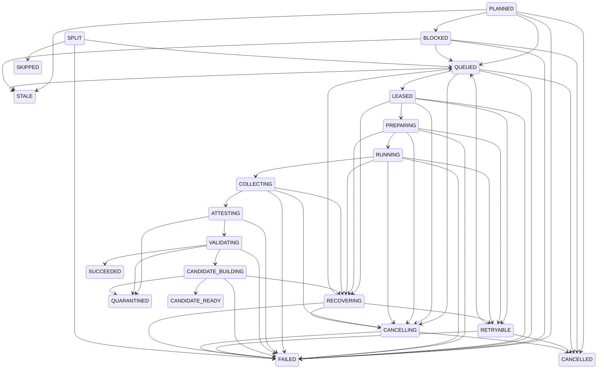

# Операционная инструкция adaptive subagents v2

## Назначение и границы

Инструкция относится к Codex 0.144.4 и расширению
`codex-smart-subagents` версии 0.1.0. Умный режим после установки по умолчанию выключен.
Установка подготавливает расширение и управляемую оболочку, но не
меняет корневую модель, уровень рассуждения, `sandbox_mode`,
`approval_policy`, доверие к проекту или содержимое пользовательских задач.

Дочерние процессы запускаются с `--ignore-user-config`. Корневая сессия
сохраняет текущие настройки и остаётся доверенным координатором.

## Фактический контракт умного хода

Событие `UserPromptSubmit` имеет общий бюджет меньше двух секунд: оно двумя
ограниченными вызовами Git фиксирует корень, `HEAD` и отпечаток состояния,
получает одноразовую привязку хода и добавляет только непрозрачный контекст.
Медленный или недоступный контроллер останавливает именно умный ход, не меняя
пользовательские настройки.

Корневая модель не меняется. Для каждого внешнего узла `smart_plan` выбирает:

- решение `direct`, `delegate` или `clarify`;
- `gpt-5.6-luna`, `gpt-5.6-terra` либо `gpt-5.6-sol`;
- допустимый для выбранной модели уровень рассуждения;
- читающий или пишущий профиль прав.

Вызывающая модель обязана применять определения факторов и правила графа из
схемы `smart_plan`. Контроллер отклоняет неизвестные область, профиль артефакта
или профиль проверки. Один ход допускает один смысловой план: точный
параллельный повтор объединяется в один расчёт, другая пара ключа и запроса
отклоняется до пограничной переклассификации.

Спорный узел получает ровно одну независимую переклассификацию Terra/high.
Если эта пара недоступна аккаунту или переклассификация не подтверждена, только
такой узел безопасно возвращается к `direct`; контроллер продолжает работать.
Автор всегда маршрутизируется не ниже Sol/high и остаётся единственным конечным
узлом графа.

Общие пределы: 20 внешних процессов, 6 процессов маршрута, 6 одновременных
пограничных оценок и 2 процесса Sol. При доступной Terra исполняются не более
двух маршрутов одновременно; без неё — не более трёх. `smart_plan` имеет
служебный предел ожидания 420 секунд, чтобы ограниченно обработать до 20
пограничных узлов волнами без разрыва MCP.

## Машина состояний маршрута

Диаграмма дословно отражает 21 значение `RouteState` и все 56 разрешённых
переходов `ALLOWED_TRANSITIONS`. Каждая стрелка соответствует отдельному
разрешённому переходу; подразумеваемых переходов нет.



Конечные состояния: `SUCCEEDED`, `CANDIDATE_READY`, `QUARANTINED`,
`CANCELLED`, `FAILED`, `STALE` и `SKIPPED`. Состояние `SPLIT` имеет три
исходящих перехода и не имеет входящих.

## Совместимость и готовность реального маршрута

Состояние установки `READY` подтверждает состав установленных файлов, хуки и
доступность дымовой проверки. Оно не подтверждает, что произвольный исходный
репозиторий можно передать контроллеру. Перед первым реальным маршрутом
отдельно проверить:

- платформа должна быть ровно `darwin-arm64`, а версия Codex — `0.144.4`;
- аккаунт должен предоставлять требуемые каталогом модели и уровни
  рассуждения;
- `${CODEX_HOME:-$HOME/.codex}/auth.json` должен быть обычным файлом, а не
  символической ссылкой, принадлежать текущему пользователю, иметь ровно одну
  жёсткую ссылку, права `0600` и размер от 1 байта до 1 МиБ;
- запуск выполняется из канонического корня Git на текущем `HEAD`;
- рабочая копия должна быть полностью чистой, включая неотслеживаемые файлы и
  состояние подмодулей;
- у репозитория не должно быть других связанных или внешних рабочих копий
  Git;
- дерево Git может содержать только обычные файлы режимов `100644` и `100755`;
  символические ссылки, подмодули, специальные записи, указатели и настройки
  Git LFS запрещены;
- в снимке допускается не более 20 000 файлов, 8 МиБ на один файл и 256 МиБ
  суммарно; нужен хотя бы один зафиксированный обычный файл;
- граф содержит не более 20 узлов, 60 рёбер, глубину не более 4 и не более
  двух поколений разделения;
- на этапе подготовки дочернего запуска должны оставаться как минимум 1 ГиБ
  свободного места, 512 МиБ доступной памяти и 128 файловых дескрипторов.

Контроллер и построитель снимка повторяют эти проверки и при расхождении
отказывают безопасно. `doctor`, доверие к хукам и `status=READY` не заменяют
эту проверку исходного репозитория.

## 1. Предварительная проверка

Работать из корня этого репозитория. Убедиться, что существуют `CODEX_HOME`,
каталог `~/.local/bin` и исполняемый `codex`.

Проверить версию и состояние без изменений:

```bash
codex --version
python3 scripts/install_adaptive_subagents.py
```

Ожидается `codex-cli 0.144.4` и перечень планируемых действий. Установщик
откажется при неизвестном `codex-highfd`, существующем `codex-smart` без
манифеста, конфликтующем рынке или уже установленном расширении без доказанного
владения.

## 2. Установка без включения

```bash
python3 scripts/install_adaptive_subagents.py --apply --json
```

Установщик:

1. сохраняет резервную копию `config.toml` и прежнего `codex-highfd`;
2. создаёт частный локальный рынок с
   `.agents/plugins/marketplace.json`;
3. выполняет штатные `codex plugin marketplace add` и
   `codex plugin add`;
4. переводит исходное установочное дерево в режим только для чтения;
5. ставит `codex-smart`, `codex-smart-subagents-admin` и защищённый
   `codex-highfd`;
6. записывает манифест с абсолютными путями и SHA-256;
7. запускает проверку после установки.

Вместо прямого редактирования `config.toml` используются команды Codex. Поэтому
существующие настройки корневой сессии, включая полный доступ, не
перезаписываются.

Свежая установка обычно завершается с
`readiness=AWAITING_HOOK_TRUST`. Это означает, что артефакты установлены, но
оба хука ещё не получили ручное доверие.

## 3. Ручная проверка доверия к хукам

Запустить обычную интерактивную сессию Codex без умного режима и открыть
`/hooks`. Проверить ровно две записи с
`pluginId=codex-smart-subagents@codex-settings-adaptive`:

- `userPromptSubmit`;
- `stop`.

Для каждой записи сверить команду, путь источника и текущий отпечаток, затем
выдать доверие штатным интерактивным действием Codex. Установщик не меняет
доверие сам. Состояния `untrusted` и `modified` не считаются доверенными;
разрешены только `trusted` и `managed`.

После ручного решения снова выполнить:

```bash
python3 scripts/install_adaptive_subagents.py --doctor --json
```

Ожидается `status=READY`. Отсутствующая, лишняя, выключенная или дублированная
запись не считается успехом. Не использовать обход проверки доверия.

## 4. Проверка и дымовой запуск

```bash
python3 scripts/install_adaptive_subagents.py --smoke --json
```

`--doctor` сверяет:

- версию Codex;
- манифест и отпечатки принадлежащих артефактов;
- зарегистрированный рынок и включённое расширение;
- источник расширения;
- контракт MCP из четырёх инструментов;
- цепочку `codex-highfd` и её режим `0755`;
- точный список двух хуков и их состояние доверия через строгий
  `hooks/list`.

Для `hooks/list` запускается настоящий `codex app-server` с установленным
`CODEX_HOME`. Его SQLite-каталог перенаправляется во временный приватный
`CODEX_SQLITE_HOME`, поэтому `state_5.sqlite` и сопутствующие файлы в
установленном профиле не создаются и не меняются. Проверка не выдаёт доверие
хукам и не включает умный режим. Сам Codex при запуске app-server всё же может
выполнить штатное обслуживание принадлежащих ему файлов, например обновить
`models_cache.json` или встроенные системные навыки; это не считается
изменением состояния адаптивных субагентов.

Дочерние `codex exec` получают отдельные приватные `CODEX_HOME`, `HOME`,
`TMPDIR` и `CODEX_SQLITE_HOME`. Временные `state_5.sqlite` и
`models_cache.json` проверяются и удаляются вместе со средой дочернего
процесса; они не попадают в основной профиль.

Для аттестации одноразовый токен передаётся только основному процессу Codex
через сигнальную переменную `OTEL_EXPORTER_OTLP_LOGS_HEADERS`; значение
процентно кодируется. Токен и имя этой переменной отсутствуют в аргументах и
в `shell_environment_policy.set`, поэтому команды модели их не наследуют.

Codex 0.144.4 на macOS штатно создаёт в приватном
`CODEX_HOME/tmp/arg0/codex-arg0XXXXXX` файл `.lock` и три символические ссылки:
`apply_patch`, `applypatch`, `codex-execve-wrapper`. Контроль ресурсов
разрешает только этот точный набор, только при приватных принадлежащих
пользователю родителях и только когда абсолютная цель совпадает по пути,
устройству и номеру файлового объекта с запущенным Codex. Лишнее имя,
относительная или другая цель и неприватный родитель дают
`CHILD_RESOURCE_PROBE_FAILED`.

`--smoke` дополнительно проверяет обе оболочки и выполняет MCP
`initialize`/`tools/list`. Модели при этом не вызываются, пользовательский
запрос не отправляется. До `status=READY` дымовая проверка возвращает
`AWAITING_HOOK_TRUST` и не включает умный режим.

## 5. Теневой этап

До пробного включения обычный alias через `codex-highfd` продолжает запускать
настоящий Codex напрямую.

Проверить выключенное состояние:

```bash
~/.local/bin/codex-highfd --self-test
```

В выводе должно быть `smart_enabled=0`. Для одного явного пробного запуска:

```bash
CODEX_SMART_ENABLED=1 ~/.local/bin/codex-highfd
```

Внутри сессии сначала использовать чистый доверенный репозиторий и только
читающую задачу. Не включать постоянный alias до успешных отрицательных проб
прав, аттестации фактической модели и завершения маршрута.

## 6. Ограниченный пробный запуск

Порядок расширения нагрузки:

1. один читающий узел;
2. два независимых читающих узла;
3. многоузловой читающий маршрут;
4. только затем один автор в отдельном карантине;
5. постоянное включение — отдельное решение владельца.

Для каждого этапа:

```bash
codex-smart-subagents-admin status
codex-smart-subagents-admin doctor
codex-smart-subagents-admin inspect ROUTE_ID --limit 100
codex-smart-subagents-admin explain ROUTE_ID
codex-smart-subagents-admin report ROUTE_ID --limit 100
codex-smart-subagents-admin metrics
```

`explain` показывает причину маршрутизации без раскрытия текста задачи,
`report` формирует ограниченный отчёт по маршруту, а `metrics` выдаёт
агрегированные счётчики без содержимого запросов.

Остановить ввод в действие при любом из условий:

- фактическая модель или уровень не подтверждены;
- отрицательная проба прав не прошла;
- контроллер не восстанавливает аренду;
- источник, индекс или ссылки Git изменились;
- возник неизвестный код ошибки, повреждение базы или несоответствие
  отпечатка;
- ресурсы ниже пределов каталога.
- `smart_plan` принимает неизвестный непрозрачный идентификатор;
- повтор одного хода запускает вторую пограничную оценку;
- число внешних процессов превышает предел каталога.

## 7. Восстановление, отмена и очистка

Сначала рассчитать план восстановления незавершённых попыток, публикаций и
кандидатов:

```bash
codex-smart-subagents-admin recover --dry-run
```

Применение разрешено только при остановленном контроллере:

```bash
codex-smart-subagents-admin recover --apply
```

Применение создаёт отдельную резервную копию базы до изменения состояния.
Оно не удаляет ссылки Git или карантинные кандидаты: сомнительные записи
остаются изолированными для последующего разбора.

Отмена маршрута:

```bash
codex-smart-subagents-admin cancel ROUTE_ID
```

Сначала просмотреть очистку:

```bash
codex-smart-subagents-admin cleanup --dry-run
```

Применение очистки:

```bash
codex-smart-subagents-admin cleanup --apply
```

Административная очистка не применяет и не сливает карантинный кандидат.

## 8. Откат

Сначала установить `CODEX_SMART_ENABLED=0`, остановить контроллер и завершить
либо отменить активные маршруты и попытки. Сам модуль отката не выполняет эти
действия и откажется без доказанного внешнего допуска.

Просмотр:

```bash
codex-smart-subagents-admin rollback --dry-run
```

Применение:

```bash
codex-smart-subagents-admin rollback --apply
```

Откат выполняется только при совпадении отпечатков. Он адресно удаляет
расширение и рынок, восстанавливает прежний `codex-highfd` либо удаляет
созданный, удаляет обе управляемые ссылки и принадлежащее установке дерево.
Перед первым удалением модуль неблокирующе захватывает блокировку контроллера,
повторно проверяет флаг, сокет, маршруты и попытки и удерживает блокировку до
успешного завершения либо восстановления после ошибки.

Если установленная административная ссылка недоступна или повреждена,
аварийный вход из проверенной рабочей копии репозитория выполняет тот же общий
модуль отката:

```bash
python3 scripts/rollback_adaptive_subagents.py
python3 scripts/rollback_adaptive_subagents.py --apply --json
```

Полная резервная копия `config.toml` автоматически не накатывается: это
защищает изменения пользователя, сделанные после установки. Если до установки
`config.toml` отсутствовал и после адресного удаления он пуст, файл удаляется.

База состояния, резервные копии и карантинные кандидаты после отката
сохраняются.

## 9. Диагностика отказов

- `TARGET_OWNERSHIP_CONFLICT`: цель существует, но не доказано, что она
  принадлежит установке. Не удалять её вручную до выяснения происхождения.
- `EXISTING_INSTALLATION_MISMATCH`: источник изменился или установка
  повреждена. Выполнить `--doctor`, затем решить вопрос об откате.
- `ARTIFACT_FINGERPRINT_MISMATCH`: файл или дерево изменены. Откат намеренно
  заблокирован.
- `CODEX_*_FAILED`: штатная команда Codex завершилась ошибкой. Проверить
  сохранённую резервную копию и вывод JSON.
- `MCP_SMOKE_FAILED`: установленный переходник не объявил ровно четыре
  инструмента.
- `AWAITING_HOOK_TRUST`: оба ожидаемых хука обнаружены, но хотя бы один имеет
  состояние `untrusted` или `modified`. Проверить записи через `/hooks`.
- `HOOK_DISCOVERY_INCOMPLETE`: точный список двух хуков не подтверждён.
- `ROLLBACK_PREFLIGHT_REQUIRED`: умный режим, контроллер, маршрут или попытка
  ещё активны; откат не меняет их состояние автоматически.
- `ROLLBACK_CONTROLLER_ACTIVE` или `ROLLBACK_PREFLIGHT_STALE`: состояние
  изменилось между просмотром и применением; удаление не начато.
- `UNSAFE_INSTALL_LOCK` или `ROLLBACK_UNSAFE_INSTALL_LOCK`: файл блокировки
  подменён ссылкой, жёсткой ссылкой или небезопасным файлом.
- `CHILD_RESOURCE_PROBE_FAILED`: среда дочернего процесса содержит
  неподдерживаемый файловый объект, небезопасную ссылку либо сведения о
  процессах не удалось измерить закрытым способом.
- `ATTESTATION_FAILED`: локальный приёмник не получил либо не подтвердил
  точные модель, уровень рассуждения, версию и идентификатор диалога; результат
  ребёнка не принимается.
- `ROLLBACK_BACKUP_CONFLICT`: резервная копия либо маркер отсутствующего файла
  повреждены; расширение не удаляется.
- `CONFIG_CHANGED_DURING_CLEANUP` или
  `ROLLBACK_CONFIG_CHANGED_DURING_REPAIR`: `config.toml` изменился параллельно.
  Новые данные сохранены и не перезаписываются резервной копией.

Живой профиль `~/.codex` не следует ремонтировать заменой всего
`config.toml`, пока не доказано отсутствие более новых пользовательских
изменений.
