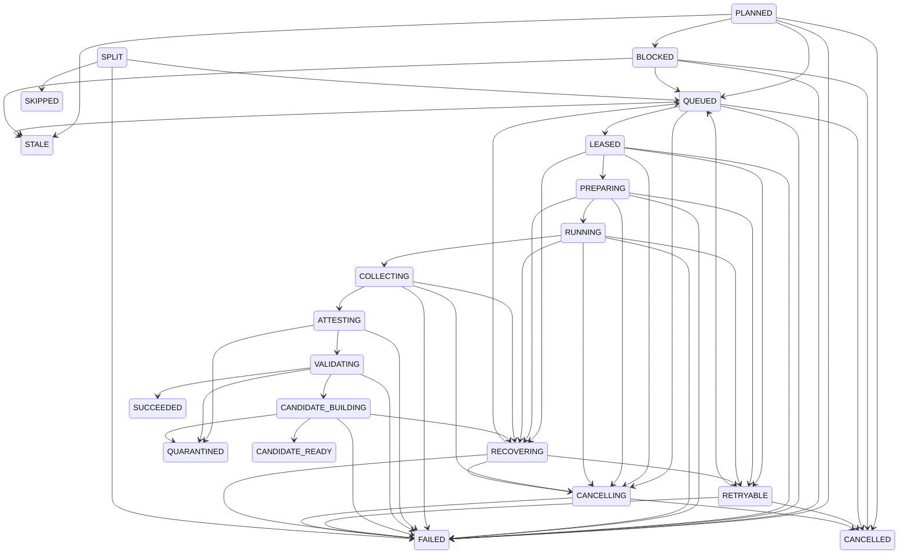

# Операционная инструкция адаптивных субагентов версии 2

## Статус инструкции

Инструкция описывает предусмотренный пользовательский путь
`codex-smart-subagents 0.2.0` и охватывает установщик, обычную управляемую
точку входа `codex`, диагностическую оболочку `codex-smart`, полный
контроллер версии 2, четыре инструмента умного хода, дочерний `codex exec`,
возврат результата и карантин пишущего
субагента. Живые проверки и точные наблюдаемые идентификаторы опубликованы в
[итоговом отчёте](../analysis/2026-07-20-adaptive-subagents-v2-validation.md).

Краткое объяснение находится в [README расширения](../../plugins/codex-smart-subagents/README.md#быстрый-старт),
а последовательности действий показаны в
[диаграммах запроса, публикации и восстановления](../analysis/adaptive-subagents-v2-flow.md).

Быстрые переходы к схемам:

- [полный запрос](../analysis/adaptive-subagents-v2-flow.md#полный-поток-запроса);
- [пишущий результат](../analysis/adaptive-subagents-v2-flow.md#поток-пишущего-результата);
- [жизненный цикл установки](../analysis/adaptive-subagents-v2-flow.md#обновление-откат-и-удаление-установки);
- [восстановление установщика](../analysis/adaptive-subagents-v2-flow.md#восстановление-установщика-после-прерывания);
- [восстановление маршрута](../analysis/adaptive-subagents-v2-flow.md#восстановление-маршрута-после-прерывания).

## Что устанавливается

По умолчанию установщик использует:

- текущий `CODEX_HOME`, обычно `~/.codex`;
- каталог команд `~/.local/bin`;
- состояние `~/.codex/state/codex-smart-subagents-v2`;
- исполняемый файл `codex` из `PATH`;
- исходники из текущего репозитория.

Он создаёт принятую активацию и две стабильные ссылки:

- `~/.local/bin/codex-smart` — интерактивная оболочка с адаптивной
  маршрутизацией;
- `~/.local/bin/codex-smart-subagents-admin` — административное чтение и
  восстановление.

Команда `codex` не заменяется исполняемым файлом в `PATH`. Отдельный
согласователь точки входа публикует `~/.local/bin/codex-highfd` и файл
псевдонимов `~/.codex/codex-autonomous-aliases.zsh`: обычный `codex` включает
два признака управляемого запуска, а `codex-native` и профильные псевдонимы
явно выключают их. Установщик регистрирует локальный рынок и расширение
штатными командами Codex и записывает квитанцию, связанную с абсолютными
путями, активацией и отпечатком входов установки. В отпечаток входят
исходники, лексический путь и содержимое выбранного Codex, а также
канонический путь и содержимое Python, которым запущен установщик.

## Предварительные условия

1. Запускать команды из корня этого репозитория.
2. Использовать одну из проверенных стабильных версий Codex: `0.144.4`,
   `0.144.5`, `0.144.6` или `0.145.0`. Неизвестный будущий выпуск безопасно переводит
   запуск в обычный режим до проверки его точек подключения и добавления в
   перечень совместимости.
3. Использовать Python не ниже `3.11`. Рабочая активация не требует внешних
   пакетов Python: закрытая проверка JSON Schema поставляется в исходниках.
   `jsonschema` и `referencing` относятся только к контуру разработки и не
   копируются в активацию.
4. Текущий каталог поддерживаемых платформ содержит `darwin-arm64`.
5. Учётная запись должна предоставлять точные пары, которые нужны конкретному
   маршруту: `gpt-5.6-luna`, `gpt-5.6-terra` и `gpt-5.6-sol` с допустимыми для
   них уровнями рассуждения. Отсутствующая пара не заменяется более слабой.
6. Для дочернего запуска использовать канонический корень Git с зафиксированным
   `HEAD` и полностью чистой рабочей копией, включая неотслеживаемые файлы и
   подмодули. Связанные или внешние рабочие копии не поддерживаются. Контроллер
   отдельно проверяет исходное дерево, индекс, ссылки и ресурсные пределы перед
   каждым запуском.
7. В `~/.local/bin` не должно быть чужих файлов с именами `codex-smart` или
   `codex-smart-subagents-admin`; установщик не перезаписывает путь без
   доказанного владения.

Проверить версию:

```bash
codex --version
python3 --version
```

## Машина состояний маршрута

Диаграмма отражает канонический договор состояний и разрешённых переходов.
Неуказанный переход запрещён.



Конечные состояния договора: `SUCCEEDED`, `CANDIDATE_READY`, `QUARANTINED`,
`CANCELLED`, `FAILED`, `STALE` и `SKIPPED`. Диаграмма сохраняет полный
машинный договор. Публичный `smart_plan` принимает граф из 1–20 узлов, не
более 60 связей и глубиной не более 4. Граф должен быть без циклов; допустимый
единственный пишущий узел является конечным и зависит прямо либо косвенно от
всех читающих узлов.

`CANDIDATE_READY` сохраняется в полном договоре состояний и при переносе
прежних записей. В текущем производственном пути
успешная попытка пишущего узла завершается как `SUCCEEDED`, а
публикация кандидата отдельно получает `VERIFIED`. Поэтому оператор сверяет
состояние узла и запись в разделе
`candidates` раздельно; одно значение не заменяет другое.

## 1. Просмотр установки

Просмотр ничего не изменяет:

```bash
python3 scripts/install_adaptive_subagents.py --json
```

Он проверяет исходное дерево и возможности Codex, вычисляет отпечаток всех
входов установки, включая лексический путь и содержимое выбранного Codex и
канонический путь и содержимое текущего Python, и возвращает `status=planned`
со списком действий. Для другого профиля или расположения можно явно задать:

```bash
python3 scripts/install_adaptive_subagents.py \
  --codex-home /абсолютный/путь/к/codex-home \
  --bin-dir /абсолютный/каталог/команд \
  --state-home /абсолютный/каталог/состояния \
  --codex-binary /абсолютный/путь/к/codex \
  --json
```

Те же пути следует использовать в последующих командах проверки этой
нестандартной установки.

## 2. Первая установка

```bash
python3 scripts/install_adaptive_subagents.py --apply --json
```

Завершённая первая установка возвращает:

- `status=installed`;
- фактический `readiness`, который нельзя подменять предположением о
  готовности;
- ненулевые `operationId` и `attemptId`;
- упорядоченный набор `changes` и смысловой `resultFingerprint`.

Идентификаторы установки и активации, фактическая версия Codex и отпечаток
источника находятся в закрытом объекте `extensions`.

До записи квитанции установщик поднимает полный контроллер, подтверждает
активацию и частный командный сокет, затем регистрирует рынок и расширение.
Если первый запуск не завершён, установщик пытается точно убрать только то,
что создала эта попытка. Неизвестный существующий объект не перезаписывается.

Если диагностика после установки возвращает
`readiness=AWAITING_HOOK_TRUST`, выполнить такой отдельный шаг:

```bash
~/.local/bin/codex-smart
# в открывшейся сессии: /hooks
```

В `/hooks` проверить источник
`codex-smart-subagents@codex-settings-adaptive` и ровно две записи
`UserPromptSubmit` и `Stop`, затем принять решение о доверии вручную.
Установщик не обходит это решение. После него завершить текущую сессию,
запустить новую диагностику и только после фактического `readiness=READY`
выполнять дымовую проверку:

```bash
python3 scripts/install_adaptive_subagents.py --doctor --json
python3 scripts/install_adaptive_subagents.py --smoke --json
```

## 3. Повторная установка и обновление

Повторить ту же команду:

```bash
python3 scripts/install_adaptive_subagents.py --apply --json
```

При точном совпадении квитанции, отпечатка источника, путей, регистрации,
активации, доверия хукам и живого контроллера результат имеет:

```text
status=unchanged
readiness=READY
```

Если доверие хукам ещё не принято либо контроллер не доказан, `status` и
`readiness` отражают это фактическое состояние вместо указанной пары.

Повтор также проверяет контроллер и при необходимости восстанавливает его.
Это идемпотентный случай: новая установка, новая активация и вторые стабильные
ссылки не создаются.

Если исходники либо выбранный исполняемый файл Codex имеют новый доказанный
отпечаток, тот же `--apply` становится обновлением. Установщик создаёт
постоянный журнал до
первого эффекта, закрывает новые допуски, ждёт завершения активных работ,
усиливает режим обслуживания, останавливает старый контроллер, публикует новую
активацию и принимает новый контроллер. Шлюз открывается только после
манифеста, квитанции и доказанного отсутствия журнала. Посторонний путь,
регистрация или квитанция по-прежнему дают закрытый отказ без перезаписи.

## 4. Проверка установки

Полная диагностика установочного контура:

```bash
python3 scripts/install_adaptive_subagents.py --doctor --json
```

Условие перехода к дымовой проверке — фактические `status=READY` и
`readiness=READY`. Возможные состояния:

- `READY` — активация, принадлежащие установке объекты и командный сокет
  подтверждены;
- `AWAITING_HOOK_TRUST` — установка готова, но Codex ожидает явного решения
  пользователя о доверии хукам;
- `DEGRADED` — постоянная активация видна, но полный рабочий контроллер не
  подтверждён;
- `BROKEN` — связанная активация не доказана; оболочка использует только
  обычный путь Codex.

Дымовая проверка:

```bash
python3 scripts/install_adaptive_subagents.py --smoke --json
```

Она разрешена только после `readiness=READY`, запускает установленную оболочку с
`--version` и не отправляет пользовательскую задачу модели.

## 5. Обычный запуск и нативный обход

После готовности расширения последовательно выполнить предварительный
просмотр, применение и диагностику пользовательской точки входа:

```bash
python3 scripts/reconcile_codex_entrypoint.py --preview --json
python3 scripts/reconcile_codex_entrypoint.py --apply --json
python3 scripts/reconcile_codex_entrypoint.py --doctor --json
```

Только для осознанного возврата к прежней точке входа выполнить отдельно:

```bash
python3 scripts/reconcile_codex_entrypoint.py --rollback --json
```

`--preview` и `--doctor` ничего не записывают, даже родительские каталоги и
файл блокировки. Первый `--apply` переносит известные прежние `codex-highfd` и
псевдонимы в управляемый вид; повтор с теми же байтами возвращает `unchanged`.
`--rollback` восстанавливает исходные байты и режимы либо отсутствие каждого
из двух целевых файлов. Согласователь не создаёт `~/.local/bin/codex`, не
меняет `PATH` и не владеет чужими файлами с таким именем.

Новый интерактивный диалог с адаптивным контроллером:

```bash
codex
```

Поддерживается, например, явный рабочий каталог:

```bash
codex -C /путь/к/репозиторию
```

Псевдоним `codex` выставляет `CODEX_SMART_ENABLED=1` и
`CODEX_SMART_REQUIRED=1`, затем передаёт запуск в `codex-highfd`.
`codex-highfd` поднимает предел файловых дескрипторов и вызывает
`codex-smart`; `codex-smart` классифицирует аргументы, готовит контроллер и
запускает настоящий Codex только абсолютным путём.

Если модель основного диалога не задана, управляемая оболочка добавляет
`gpt-5.6-terra` и уровень `medium`. Явно заданные `--model` и
`model_reasoning_effort` сохраняются для основного диалога; модели дочерних
узлов всё равно выбирает контроллер. `codex help`, `codex update` и другие
служебные либо явно нативные формы выполняются как обычный Codex без
подготовки контроллера. Текст после `--` не является служебной подкомандой:
`codex -- help` и `codex -- update` остаются пользовательскими запросами.

Если обязательный управляемый интерактивный запуск не может доказать
поддержанный контур, он завершается кодом 69 и сообщает использовать
`codex-native`; скрытого перехода на обычный путь нет. Нативный обход:

```bash
codex-native
```

Профильные псевдонимы `codexs`, `codexro`, `codexwide` и `codexfa` всегда
нативны. `codexfd` запускает только диагностику файловых дескрипторов.
`codex-smart` остаётся установленной диагностической командой для прямой
проверки оболочки и принятия доверия к хукам до согласования обычного
`codex`, но не является рекомендуемым повседневным входом. Уже открытый
разговор нельзя задним числом перевести в управляемый режим: изменения
псевдонимов действуют только для нового процесса.

Даже для поддержанного интерактивного вызова адаптивный режим требует три
основания: неизменяемый `.mcp.json` объявляет ровно четыре обязательных
инструмента с режимом `approve`; смысловая пользовательская политика не
выключает и не подменяет этот сервер; запущенный встроенный MCP фактически
возвращает тот же `tools/list` и публикует связанную с процессом аттестацию.
Codex запускает MCP лениво, поэтому перед созданием контекста хода
`UserPromptSubmit` проверяет первые два основания и живой контроллер, но не
ждёт ещё не созданную аттестацию. MCP проверяет текущую целевую политику и
публикует аттестацию при первом инструментальном обращении. Несвязанная
перезапись `config.toml`, например сохранение состояния доверия обработчиков,
не отключает адаптивный путь.

Если проверка до создания контекста внутри уже запущенного управляемого
процесса не сошлась, `TurnContext` не создаётся. Если уже после этого не
запустился ленивый MCP, `Stop` не образует бесконечный цикл: после двух
напоминаний завершение разрешается. При неожиданном обычном ходе сначала
выполнить только читающие проверки:

```bash
codex --version
codex plugin list --json
python3 scripts/install_adaptive_subagents.py --doctor --json
```

Затем проверить доверие к `UserPromptSubmit` и `Stop` через `/hooks` в новой
сессии. Не нужно вручную дописывать таблицу MCP в `config.toml`: отсутствие
пользовательского переопределения наследует строгие настройки установленного
расширения.

После пользовательского запроса хук требует один `smart_plan`. Основной
диалог передаёт закрытый список `nodes`; каждый элемент содержит
`clientNodeId`, `dependencyIds` и отдельный `routingInput`. Контроллер отдельно
выбирает модель и уровень рассуждения для каждого узла. Пользователю не нужно
вручную распределять Luna, Terra и Sol внутри маршрута.

Общее решение относится ко всему графу. Если хотя бы один узел требует
уточнения, возвращается `clarify`. Если решения узлов смешивают `direct` и
`delegate`, возвращается `direct` и ни один узел не запускается. Только когда
все узлы получили `delegate`, основной диалог последовательно вызывает
`route_start` для готовых узлов и читает ход через `smart_wait`.

`route_start` допускает узел только после состояния `SUCCEEDED` у всех его
зависимостей. Потомок получает ограниченные результаты зависимостей с
размерами и отпечатками. Отказ либо аварийное восстановление узла закрывает
его ещё не запущенных потомков. Повтор `smart_plan` с тем же ключом возвращает
тот же маршрут, а повтор `route_start` — ту же долговечную квитанцию запуска.

Если незавершённый запуск больше не нужен, основной диалог вызывает
`smart_cancel` с тем же `startRequestId`. Допустимые причины:
`USER_REQUESTED` — явная отмена пользователем, `TURN_ENDED` — завершение хода,
`ROUTE_SUPERSEDED` — замена маршрута. Повтор возвращает тот же итог отмены.
Это четвёртый инструмент умного хода; одноимённой административной команды
`cancel` в версии 2 нет.

## 6. Проверка работающего контура

```bash
~/.local/bin/codex-smart-subagents-admin status
```

`status` не меняет состояние и возвращает:

- идентификаторы активации и базы;
- эпоху управления;
- состояние и доступность контроллера;
- счётчики состояний маршрутов, попыток и временных областей.

Команда не перечисляет `routeId`: идентификатор конкретного маршрута нужно
взять из `smart_plan` либо последующего результата умного хода.

Коды нормального чтения:

- `READY` — активация и живой контроллер подтверждены;
- `PERSISTED_READY` — долговечная активация подтверждена, но живой контроллер
  в момент проверки не подтверждён.

Проверка необходимости восстановления:

```bash
~/.local/bin/codex-smart-subagents-admin doctor
```

Возможные коды:

- `READY` — контроллер доступен и действий восстановления нет;
- `CONTROLLER_UNAVAILABLE` — постоянное состояние подтверждено, контроллер
  недоступен;
- `RECOVERY_REQUIRED` — найдены доказанные остатки попыток;
- `RECOVERY_BLOCKED` — найдено неизвестное или противоречивое состояние.

## 7. Просмотр одного маршрута

Идентификатор маршрута возвращают `smart_plan`, `route_start`, `smart_wait` и
итоговый результат умного хода. Он имеет вид `route2_` и 32 шестнадцатеричных
знака:

```bash
~/.local/bin/codex-smart-subagents-admin inspect \
  route2_0123456789abcdef0123456789abcdef
```

Команда показывает состояние маршрута, узлы, попытки, события, временные
области и кандидаты. В каждом узле сверять поля `model` и
`reasoningEffort`: это выбранная именно для него пара. Состояние кандидата
`VERIFIED` доказывает публикацию, но не применяет, не сливает и не отправляет
кандидат автоматически. Текст исходной миссии и пользовательского запроса
административная проекция не возвращает.

`inspect` не возвращает зависимости графа и итоговое поле `terminalResult`.
Зависимости нужно сохранить из ответа `smart_plan`, а их фактический порядок
допуска сверять по событиям и состояниям узлов.
`terminalResult` возвращает `smart_wait` после завершения маршрута.

По умолчанию читается не более 100 записей каждого вида. Допустимый предел:

```bash
~/.local/bin/codex-smart-subagents-admin inspect \
  route2_0123456789abcdef0123456789abcdef --limit 200
```

`--limit` должен находиться в диапазоне от `1` до `200`.

## 8. Жизненный цикл установки

Все команды ниже возвращают строгий объект результата версии 2. Просмотр не
создаёт журнал и ничего не меняет; применение заново перечитывает состояние
под общей установочной блокировкой.

Откат к целой предыдущей активации:

```bash
python3 scripts/install_adaptive_subagents.py --rollback --preview --json
python3 scripts/install_adaptive_subagents.py --rollback --apply --json
```

Частичный откат файлов не поддерживается. Если предыдущая активация, база,
квитанция или контроллер не образуют одну доказанную связку, операция
закрывается без переключения.

Удаление установки с обязательным сохранением данных:

```bash
python3 scripts/install_adaptive_subagents.py --uninstall --retain-data --preview --json
python3 scripts/install_adaptive_subagents.py --uninstall --retain-data --apply --json
```

Удаляются только принадлежащие установке загрузчики, регистрация, стабильные
ссылки и активация. База, резервные копии, карантин и отдельная точка
восстановления перечисляются в квитанции удаления и остаются. Вариант без
`--retain-data` является неверным вызовом.

Если удаление прервалось после создания его отдельного журнала, есть два точных
пути продолжения одной и той же операции:

```bash
python3 scripts/install_adaptive_subagents.py --uninstall --retain-data --apply --json
python3 scripts/install_adaptive_subagents.py --recover --preview --json
python3 scripts/install_adaptive_subagents.py --recover --apply --json
```

Повтор `--uninstall --retain-data --apply --json` продолжает уже существующий
журнал. Общий просмотр `--recover --preview --json` распознаёт тот же журнал
без изменений: `extensions.lifecycleAdapter.journalKind=uninstall`, а
сохранённый идентификатор находится в
`extensions.lifecycleAdapter.internalOperationId`. Верхнее поле `operationId`
при просмотре остаётся пустым. Последующий `--recover --apply --json`
продолжает тот же `operationId` и возвращает его после завершения. Эти пути не
создают две операции удаления.

### Восстановление установщика

Продолжение прерванной установки, обновления, отката или удаления:

```bash
python3 scripts/install_adaptive_subagents.py --inspect --json
python3 scripts/install_adaptive_subagents.py --recover --preview --json
python3 scripts/install_adaptive_subagents.py --recover --apply --json
```

`--inspect` и `--recover --preview` ничего не меняют. Применять план следует
только когда он относится к ожидаемой операции и все личности, пути и
квитанции совпали. Для журнала удаления пробный результат содержит
`extensions.lifecycleAdapter.journalKind=uninstall` и сохранённый
`extensions.lifecycleAdapter.internalOperationId`, а применение продолжает тот
же `operationId`. Журнал уборки общий установочный `--recover` не продолжает.
Восстановление установщика также отличается от восстановления маршрутов и
процессов административной оболочкой в следующем разделе.

### Восстановление временных процессов установщика

Каждый временный дочерний процесс установщика сначала получает отдельные
группу и сеанс, затем сохраняется в
`CODEX_HOME/install-manifests/transient-process-ownership-v2/`. Запись содержит
точные PID, идентификаторы группы и сеанса, маркер начала процесса, контекст
операции и состояние `OWNED` либо `CLEANUP_REQUIRED`. Доступ ребёнка к SQLite
и каналу готовности открывается только после публикации этой записи.
Первичный контроллер и короткие служебные команды сначала входят в малую
защитную обёртку и ждут однобайтовое разрешение родителя. Родитель выдаёт его
только после успешной публикации владения. Если публикация не состоялась или
родитель исчез, обёртка получает закрытие канала, завершается с кодом `125` и
не запускает целевую программу.

Если предыдущий запуск оборвался с неразрешённой записью, любая обычная новая
изменяющая команда, кроме явного `--recover --apply`, завершается кодом
`DURABLE_PROCESS_OWNERSHIP_OUTSTANDING`. Не удалять файл записи и не завершать
процесс вручную. Сначала сохранить результаты чтения без изменений:

```bash
python3 scripts/install_adaptive_subagents.py --inspect --json
python3 scripts/install_adaptive_subagents.py --recover --preview --json
```

Оба результата показывают закрытую проекцию
`extensions.durableProcessOwnership`: для каждой записи доступны только
`leaseId`, `state` и `contextKind`, без секретов и полного контекста. Просмотр
показывает точный установочный журнал, но сам не согласует процессы.
Штатное согласование выполняет только применение восстановления:

```bash
python3 scripts/install_adaptive_subagents.py --recover --apply --json
```

Команда получает конечную файловую блокировку, перечитывает запись, сверяет
PID, группу, сеанс и маркер начала, а затем действует в пределах общего срока
восстановления. Для непринятого служебного процесса допустимо только мягкое
завершение точной группы через последовательность `SIGCONT`, `SIGTERM` и при
необходимости второй `SIGCONT`; `SIGKILL` не используется. Запись кандидата
контроллера не разрешает сигнал сама по себе: без отдельного положительного
доказательства права на завершение она остаётся блокирующей. Если процесс уже
исчез либо кандидат точно принят, запись удаляется только после повторного
доказательства и синхронизации каталога.

После успеха повторить чтение и убедиться, что прежний `leaseId` больше не
числится. Если основной журнал уже существовал, восстановление продолжает тот
же `operationId`; если сбой случился раньше, команда завершает только
согласование остаточного процесса. Повтор самой команды восстановления должен
быть безопасным: уже разрешённая запись не создаётся заново. Диаграмма этого
пути находится в разделе
[«Восстановление временного процесса установщика»](../analysis/adaptive-subagents-v2-flow.md#восстановление-временного-процесса-установщика).

Уборка только доказанных неиспользуемых поколений:

```bash
python3 scripts/install_adaptive_subagents.py --cleanup --preview --json
python3 scripts/install_adaptive_subagents.py --cleanup --apply --json
```

Уборка удаляет деревья неактивных поколений, но
старые commit-квитанции не удаляются: они остаются доказательством владения.
После успешной уборки
публикуется отдельная cleanup-квитанция. Если операция прервалась, она
продолжается повтором той же команды `--cleanup --apply --json`, а не через
общий `--recover`.

Чтение полного установочного состояния без изменений:

```bash
python3 scripts/install_adaptive_subagents.py --inspect --json
```

Для `rollback`, `uninstall`, `recover` и `cleanup` обязателен ровно один из
`--preview` и `--apply`. `inspect`, `doctor` и `smoke` запрещают оба флага.
Коды завершения: `0` — нет блокирующей проблемы; `2` — команда выполнена, но
готовность не `READY`; `64` — неверный вызов; `70` — внутренняя либо
структурная ошибка; `75` — доказанная временная занятость.

## 9. Восстановление маршрута после прерывания

Этот раздел относится к маршрутам, дочерним процессам, временным областям и
кандидатам. Он не заменяет установочный `--recover` для установки, обновления,
отката либо удаления и не заменяет повтор отдельной команды уборки.

Сначала построить план без изменений:

```bash
~/.local/bin/codex-smart-subagents-admin recover --dry-run
```

Состояние `RECOVERY_NOT_REQUIRED` означает, что действий нет.
`RECOVERY_REQUIRED` содержит ограниченный перечень доказанных действий.
`RECOVERY_BLOCKED` означает, что применять автоматический план нельзя.

Если `status` показывает живой контроллер, сначала остановить только принятую
личность контроллера:

```bash
~/.local/bin/codex-smart-subagents-admin stop
```

Команда дважды сверяет PID и маркер начала процесса, посылает сигнал только
после точного совпадения и ограниченно ждёт подтверждённого исчезновения.
Повтор при уже отсутствующем контроллере возвращает безопасный успешный
результат. Не заменять эту команду сочетанием `pgrep` и ручного сигнала.

После остановки снова построить план без изменений и только затем применить
его:

```bash
~/.local/bin/codex-smart-subagents-admin recover --dry-run
~/.local/bin/codex-smart-subagents-admin recover --apply
```

Команда повторно проверяет, что контроллер не работает, получает исключительную
блокировку и применяет только целиком доказанный план. Успех возвращает
`RECOVERY_APPLIED`; повтор после него возвращает `RECOVERY_NOT_REQUIRED`.

Автоматическое восстановление строит единый исходный план для незавершённых
разрешений запуска, попыток, временных областей и намерений публикации. До
первых изменений этого применения оно проверяет все области; неизвестный
процесс, каталог или ссылка даёт `RECOVERY_BLOCKED` без начальных записей.
Это не общая транзакция между SQLite, процессами, файловой системой и Git:
каждое внешнее действие имеет заранее записанное намерение и повторную
проверку.

Живой остаточный процесс затрагивается только при совпадении PID и маркера
начала. После завершения его группы контроллер доказывает отсутствие процесса
и переводит попытку, узел, незапущенных потомков и маршрут в конечные
состояния. Для каталога должны одновременно совпасть путь, владелец, режим,
маркер, устройство и номер файлового объекта. Незарегистрированный каталог
остаётся нетронутым.

Намерение публикации кандидата записывается до ссылки. Восстановление отличает
точную ссылку (`RECOVERED`, затем `VERIFIED`), отсутствующую (`ABORTED`) и
несовпадающую (`QUARANTINED`). Ни один из этих исходов не применяет, не сливает
и не отправляет кандидат Git автоматически.

## 10. Практическая проверка маршрутизации

Для первого испытания использовать чистый тестовый репозиторий и последовательно
проверить:

1. простую читающую подзадачу с ожидаемой Luna;
2. подзадачу средней сложности с ожидаемой Terra;
3. сложную читающую подзадачу с ожидаемой Sol;
4. граф «два независимых читателя → итоговый синтез» с разными парами;
5. только затем пишущую подзадачу с отдельным кандидатом.

После каждого маршрута сохранить ответы `smart_plan` и конечного `smart_wait`,
затем выполнить `status` и `inspect` по возвращённому `routeId`. `status`
показывает только агрегаты; точный идентификатор берётся из результата умного
хода. Проверить:

- выбранные `model` и `reasoningEffort` каждого узла;
- зависимости по ответу `smart_plan`, а по событиям `inspect` — запуск только
  после их успешного завершения и ограниченную передачу результатов;
- конечное состояние попытки;
- наличие подтверждения дочернего запуска;
- наличие `terminalResult` в конечном ответе `smart_wait`;
- для автора — состояние публикации `VERIFIED` либо `QUARANTINED` и отсутствие
  изменений в исходной рабочей копии.

При недоступности требуемой модели ожидается явный отказ, а не запуск более
слабой модели.

## 11. Разбор отказов

| Код | Значение | Действие |
|---|---|---|
| `CODEX_VERSION_INCOMPATIBLE` | Версия нестабильна либо не входит в проверенный набор `0.144.4`, `0.144.5`, `0.144.6`, `0.145.0` | Использовать проверенный стабильный Codex; для нового выпуска дождаться отдельной проверки совместимости и повторить просмотр |
| `STABLE_LINK_CONFLICT` | Имя стабильной команды уже занято | Установить происхождение объекта; не перезаписывать его вручную |
| `REGISTRATION_CONFLICT` | Рынок или расширение уже зарегистрированы без квитанции этой установки | Сначала выяснить владельца регистрации |
| `SOURCE_DIGEST_MISMATCH` | Наблюдаемый источник не совпадает ни с принятой, ни с подготовленной активацией | Не править квитанцию; выполнить `--inspect --json`, затем просмотр `--recover` |
| `INSTALLATION_MISMATCH` | Пути, регистрация или активация расходятся | Выполнить `--doctor --json` и сохранить полный код причины |
| `CONTROLLER_NOT_FULL_READY` | Супервизор не доказал полный контроллер | Проверить `status`, затем `doctor` и пробный план восстановления |
| `V2_STATE_UNCONFIRMED` | Административная команда не доказала привязку состояния | Не изменять базу; проверить квитанцию, активацию и пути |
| `ROUTE_NOT_FOUND` | Указанного маршрута нет в принятой базе | Проверить точный `routeId` и профиль `CODEX_HOME` |
| `CONTROLLER_ACTIVE` | `recover --apply` вызван при живом контроллере | Выполнить `stop`, снова `recover --dry-run` и только затем `recover --apply` |
| `RECOVERY_BLOCKED` | План содержит неизвестное или противоречивое состояние | Ничего не удалять вручную; сохранить вывод для разбора |
| `DURABLE_PROCESS_OWNERSHIP_OUTSTANDING` | Предыдущий установщик оставил точную неразрешённую запись временного процесса | Не удалять запись и не посылать сигнал вручную; выполнить установочные `--inspect`, `--recover --preview`, затем совпавший `--recover --apply` |
| `OUTSTANDING_PROCESS_CLEANUP_OBLIGATION` | Текущая операция завершилась с одной или несколькими неразрешёнными обязанностями очистки | Сохранить `extensions.cleanupRequired.obligationIds`; не повторять изменяющую команду вслепую, а выполнить `--inspect`, `--recover --preview` и затем доказанное восстановление |
| `DURABLE_PROCESS_OWNERSHIP_CALLBACK_FAILED` | Публикация либо переход долговечной записи владения завершились неуспешно | Сохранить `extensions.cleanupRequired`; не удалять запись и не завершать процесс вручную, использовать штатное восстановление |
| `SUPERVISED_COMMAND_CLEANUP_REQUIRED` | Короткая дочерняя команда не доказана как полностью завершённая в пределах общего срока | Сохранить `extensions.cleanupRequired.cleanupObligation`; проверить состояние через чтение и продолжать только штатным восстановлением |
| `INITIAL_CONTROLLER_BOOTSTRAP_TIMEOUT`, `SUPERVISED_COMMAND_BOOTSTRAP_*` | Защитная обёртка процесса не подтвердила готовность либо не получила разрешение после публикации владения | Не запускать целевую команду вручную; сохранить долговечную запись и выполнить штатное чтение и восстановление |
| `DURABLE_OWNERSHIP_LOCK_TIMEOUT` | Закончился общий срок получения блокировки хранилища владения | Повторить только чтение; проверить, кто держит установочную операцию, затем заново выполнить штатное восстановление |
| `DURABLE_OWNERSHIP_RECOVERY_LOCK_TIMEOUT` | Другой восстановитель удерживал единственное право на доказательства, сигналы и переход записи до локального предела | Не запускать второе восстановление параллельно; дождаться первого, перечитать `--inspect`, затем строить новый пробный план |
| `DURABLE_OWNERSHIP_RECOVERY_LOCK_INVALID`, `DURABLE_OWNERSHIP_RECOVERY_LOCK_RELEASE_FAILED` | Файл блокировки восстановления не соответствует закрытой форме либо его освобождение не доказано | Не менять файл вручную; сохранить его метаданные и полный результат, прекратить изменяющие команды до разбора |
| `DURABLE_OWNERSHIP_*_UNSAFE`, `DURABLE_OWNERSHIP_RECORD_INVALID`, `DURABLE_OWNERSHIP_BINDING_MISMATCH` | Каталог, запись или личность процесса не совпали с закрытым договором | Ничего не исправлять вручную; сохранить каталог владения и полный структурированный результат для разбора |
| `MUTATING_OPERATION_DEADLINE_TIMEOUT`, `RECOVERY_OPERATION_DEADLINE_TIMEOUT`, `MUTATING_LOCK_BUDGET_TIMEOUT`, `RECOVERY_LOCK_BUDGET_TIMEOUT` | Корневая операция исчерпала единый срок; вложенное ожидание не должно продолжаться | Повторить `--inspect` и пробный план; применять только тот же доказанный журнал после освобождения блокировки |

Внутри записи `CLEANUP_REQUIRED` поле
`cleanupObligation.reasonCode=DURABLE_PROCESS_OWNERSHIP_RECONCILIATION_REQUIRED`
объясняет необходимость повторного согласования, а
`cleanupObligation.deadlineProof.timeoutCode=DURABLE_OWNERSHIP_RECOVERY_TIMEOUT`
фиксирует локальный предел ожидания группы. Это вложенные доказательства, а не
верхнеуровневые коды результата установщика.

Публичный объект `extensions.cleanupRequired` закрыт и содержит ровно два
поля: отсортированный непустой список `obligationIds` без повторов и
`cleanupObligation`. Второе поле равно проверенному закрытому доказательству
одной обязанности либо `null`, когда наружу можно безопасно вывести только
идентификаторы. Отсутствие полного доказательства не разрешает ручное
завершение процесса.

Отдельно разбирать отказы кандидата-контроллера при обновлении или откате:

| Код или группа кодов | Где остановился переход | Действие оператора |
|---|---|---|
| `CANDIDATE_SPAWN_FAILED`, `CANDIDATE_SPAWN_DEADLINE_EXPIRED` | Кандидат не был доказан как запущенный в отведённом окне | Выполнить установочные `--inspect --json` и `--recover --preview --json`; не запускать кандидат вручную |
| `CANDIDATE_DISPATCH_LOCK_TIMEOUT` | Не удалось в конечный срок получить единственное право на проверку и запуск кандидата | Не выполнять параллельный повтор; сохранить `--inspect --json` и дождаться завершения владельца блокировки перед пробным восстановлением |
| `CANDIDATE_DISPATCH_OWNERSHIP_OUTSTANDING`, `CANDIDATE_DISPATCH_RETRY_EFFECT_PRESENT` | Предыдущая попытка уже оставила долговечное владение, регистрацию либо намерение принятия | Повторный запуск запрещён; продолжать только через `--inspect --json`, `--recover --preview --json` и доказанное восстановление |
| `CANDIDATE_DISPATCH_RETRY_LIMIT_REACHED` | Исчерпаны восемь последовательных доказанных попыток запуска одного неизменяемого кандидата | Не создавать девятую попытку и не очищать квитанции вручную; сохранить архив квитанций и состояние для разбора |
| `CANDIDATE_SPAWN_COMPLETED_UNOBSERVABLE` | Эффект запуска мог завершиться, но его квитанция не наблюдается достаточно точно | Не повторять запуск; прочитать журнал через `--inspect --json` и построить только `--recover --preview --json` |
| `CANDIDATE_SPAWN_RECOVERY_EXPIRED` | Истекло ограниченное окно доказательного восстановления запуска | Не запускать кандидат заново и не удалять его остатки; сохранить вывод `--inspect --json` и пробного восстановления |
| `CANDIDATE_READY_*`, `CANDIDATE_REGISTRATION_TIMEOUT` | Не получена точная и подлинная регистрация `REGISTERED_READY` | Сохранить код и сведения журнала; строить только пробный план восстановления |
| `CANDIDATE_ACCEPT_TIMEOUT` | Ответ принятия не наблюдался вовремя; сама запись принятия могла уже сохраниться | Не запускать кандидат повторно и не посылать вторую команду; восстановление должно сверить квитанцию принятия |
| `CANDIDATE_ACCEPTED_SUCCESSOR_INVALID`, `ROLLBACK_CANDIDATE_SUCCESSOR_INVALID` | Сохранённый принятый преемник обновления либо отката не доказан как точный | Оставить шлюз закрытым; прочитать установочное состояние и пробный план восстановления |
| `CANDIDATE_PROCESS_CHANGED`, `CANDIDATE_REGISTRATION_PROCESS_CHANGED`, `CANDIDATE_REGISTRATION_WORKING_SOCKET_CHANGED`, `CANDIDATE_REGISTRATION_RECEIPT_CHANGED` | После регистрации изменилась личность процесса, сокета или квитанции | Не посылать сигнал и не удалять сокет вручную; сохранить доказательства и не применять неоднозначный план |
| `VERIFY_CANDIDATE_FAILED`, `VERIFY_CANDIDATE_ACCEPTANCE_INVALID` | Итоговая проверка кандидата либо его принятия не сошлась | Выполнить `--inspect --json`, затем `--recover --preview --json`; `--apply` допустим только для полностью совпавшего плана |
| `ROLLBACK_VERIFY_CANDIDATE_FAILED`, `ROLLBACK_VERIFY_CANDIDATE_ACCEPTANCE_INVALID` | Та же итоговая проверка не сошлась при откате | Использовать установочные `--inspect --json` и `--recover --preview --json`; не заменять их повторным ручным принятием |
| `SHUTDOWN_COMPLETION_TIMEOUT`, `SHUTDOWN_PROCESS_*`, `SHUTDOWN_LOCK_*`, `SHUTDOWN_SOCKET_*`, `SHUTDOWN_ORPHAN_PROOF_*` | Остановка старого контроллера, доказательство процесса, блокировки, сокета или остатка не завершились однозначно | Не посылать ручной сигнал и не удалять сокет; сохранить `--inspect --json`, затем построить `--recover --preview --json` |

Во всех строках таблицы команды относятся к установщику:

```bash
python3 scripts/install_adaptive_subagents.py --inspect --json
python3 scripts/install_adaptive_subagents.py --recover --preview --json
```

Ручные `kill`, удаление сокета и повторный запуск кандидата обходят
сохранённые личности и не являются штатным выходом из такого отказа.

Команды `status`, `doctor`, `inspect`, `stop` и `recover` административной
оболочки относятся к маршрутам и работающему контроллеру. Флаги жизненного
цикла одноимённого установщика относятся к активациям и журналам. Ни один из
этих интерфейсов не сливает, не применяет и не отправляет кандидат Git.

## Связанные документы

- [README расширения](../../plugins/codex-smart-subagents/README.md);
- [диаграммы работы](../analysis/adaptive-subagents-v2-flow.md);
- [итоговый отчёт живой проверки](../analysis/2026-07-20-adaptive-subagents-v2-validation.md);
- [договор жизненного цикла](../contracts/adaptive-subagents-lifecycle-v2.md);
- [договор состояния SQLite](../contracts/adaptive-subagents-state-v2.md);
- [совместимость интерфейса Codex](../contracts/codex-interface-v1.md).
