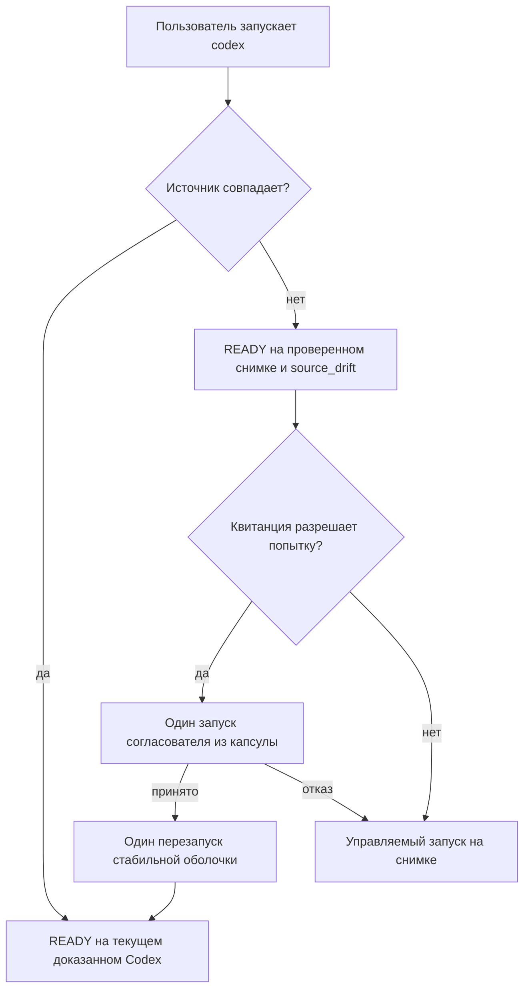

# Codex Update Self-Healing Implementation Plan

> **For agentic workers:** REQUIRED SUB-SKILL: Use superpowers:subagent-driven-development (recommended) or superpowers:executing-plans to implement this plan task-by-task. Steps use checkbox (`- [ ]`) syntax for tracking.

**Goal:** обычная команда `codex` автоматически принимает совместимое стабильное обновление Codex, а до успешного принятия продолжает управляемую работу на последнем доказанном снимке без зависимости от рабочей копии репозитория.

**Architecture:** номер версии только допускает стабильный кандидат не ниже `0.144.4`; окончательное принятие по-прежнему выполняют проверки интерфейса, каталога и жизненного цикла. Принятая активация содержит самодостаточный исходный корень согласователя, шлюз различает повреждение активации и изменение внешнего Codex, а отдельная закрытая квитанция ограничивает повторные попытки. Нативные вызовы всегда используют текущий системный Codex; управляемый вызов до принятия обновления использует проверенный снимок.

**Tech Stack:** Python 3.11+, стандартная библиотека Python, Codex CLI `app-server`, SQLite-состояние Codex, JSON с каноническими отпечатками SHA-256, `unittest`, существующий установочный жизненный цикл версии 2.

## Global Constraints

- Не менять правила выбора Luna, Terra и Sol, дочерние `allowedPairs`, оценочную шкалу, профили прав и число процессов.
- Каноническая стабильная версия Codex должна быть не ниже `0.144.4`; предварительные и неканонические версии отвергаются до эффектов.
- Номер версии не является доказательством совместимости: обязательны существующие проверки `--version`, `debug models --bundled`, `app-server --help`, `exec --help`, схем, политики и живого `model/list`.
- При изменении только внешнего Codex валидная активация остаётся `READY` на проверенном неизменяемом снимке и получает отдельный признак `source_drift`.
- Повреждение манифеста, активации, квитанции, базы, интерфейсного доказательства или снимка по-прежнему закрывает управляемый путь.
- Самосогласование выполняется не более одного раза на пользовательский запуск; успешный переход перезапускает стабильную оболочку не более одного раза.
- Завершённый исход `INCOMPATIBLE` не повторяется до смены двоичного файла или выпуска согласователя; временный исход `RETRY_AFTER` использует паузу 300 секунд.
- Инспектор `model/list` использует существующее SQLite-состояние Codex и допускает не более четырёх строк только известного точного сообщения обновления моделей.
- Не добавлять новые псевдонимы, фоновый системный процесс, сетевой надзор или исправления посторонних процессов `node_repl`.
- Все изменения поведения выполняются через падающий тест, минимальную реализацию, целевые проверки, независимую рецензию и отдельный коммит.
- Не редактировать производные договоры вручную, если для них существует генератор.

---

## Карта файлов и обязанностей

- `plugins/codex-smart-subagents/src/codex_smart_subagents/compatibility.py` — только синтаксический и минимальный допуск стабильной версии.
- `plugins/codex-smart-subagents/src/codex_smart_subagents/live_canary.py` — строгий сеанс `app-server` и единственная политика допустимой диагностики.
- `plugins/codex-smart-subagents/src/codex_smart_subagents/model_catalog.py` — чтение живого учётного каталога через существующее SQLite-состояние.
- `plugins/codex-smart-subagents/src/codex_smart_subagents/activation_gateway_v2.py` — доказательство `READY`, выбор живого файла или снимка и структурированный `source_drift`.
- `plugins/codex-smart-subagents/src/codex_smart_subagents/source_reconciliation_v1.py` — закрытая квитанция, пауза повторов и один ограниченный запуск самосогласователя.
- `plugins/codex-smart-subagents/src/codex_smart_subagents/activation_materializer_v2.py` — материализация самодостаточной капсулы внутри `marketplace`.
- `plugins/codex-smart-subagents/src/codex_smart_subagents/installer_upgrade_v2.py` — воспроизведение исходного отпечатка из неизменяемой капсулы.
- `scripts/install_adaptive_subagents.py` — включение установочного сценария в исходный отпечаток и обычное атомарное применение обновления.
- `plugins/codex-smart-subagents/bin/codex-smart` — вызов согласователя, однократный перезапуск и продолжение на снимке при отказе.
- `tests/smart_subagents/` — модульные, интеграционные, параллельные и отрицательные доказательства.
- `README.md`, `plugins/codex-smart-subagents/README.md`, `docs/runbooks/adaptive-subagents-v2-operations.md`, `docs/analysis/adaptive-subagents-v2-flow.md` — пользовательская навигация, эксплуатация и диаграмма.

### Task 1: Допуск стабильной версии и устойчивый живой каталог моделей

**Files:**
- Modify: `plugins/codex-smart-subagents/src/codex_smart_subagents/compatibility.py`
- Modify: `plugins/codex-smart-subagents/src/codex_smart_subagents/live_canary.py`
- Modify: `plugins/codex-smart-subagents/src/codex_smart_subagents/model_catalog.py`
- Modify: `tests/smart_subagents/test_codex_compatibility.py`
- Modify: `tests/smart_subagents/test_live_canary.py`
- Modify: `tests/smart_subagents/test_model_catalog.py`

**Interfaces:**
- Consumes: `parse_stable_codex_version(version: str) -> tuple[int, int, int]`, `StrictAppServerClient.run_session(...)`, существующее точное регулярное выражение `_MODEL_REFRESH_TIMEOUT_NOTICE`.
- Produces: `codex_version_supported(version: str, *, minimum: str = MINIMUM_STABLE_CODEX_VERSION) -> bool`; `expected_model_refresh_timeout_stderr(stderr: bytes) -> bool`; параметр `accepted_stderr: Callable[[bytes], bool] | None` у `StrictAppServerClient`; инспектор с `use_temporary_sqlite_home=False`.

- [ ] **Step 1: Записать падающие проверки допуска версии**

```python
def test_accepts_canonical_future_stable_versions_at_or_above_minimum(self) -> None:
    for version in ("0.146.0", "0.999.0", "1.0.0", "12.34.56"):
        with self.subTest(version=version):
            self.assertTrue(codex_version_supported(version))

def test_rejects_prerelease_noncanonical_and_old_versions(self) -> None:
    for version in ("0.144.3", "0.146.0-alpha.2", "v0.146.0", "00.146.0"):
        with self.subTest(version=version):
            self.assertFalse(codex_version_supported(version))
```

- [ ] **Step 2: Запустить проверку и подтвердить ожидаемое падение**

Run: `uv run --locked python -m unittest tests.smart_subagents.test_codex_compatibility -v`

Expected: проверки `0.146.0` и будущих стабильных версий падают, потому что текущий код требует членство в `VERIFIED_STABLE_CODEX_VERSIONS`.

- [ ] **Step 3: Заменить список номеров минимальным допуском**

```python
MINIMUM_STABLE_CODEX_VERSION = "0.144.4"


def codex_version_supported(
    version: str,
    *,
    minimum: str = MINIMUM_STABLE_CODEX_VERSION,
) -> bool:
    """Return whether a canonical stable version meets the minimum."""

    try:
        parsed = parse_stable_codex_version(version)
        minimum_parsed = parse_stable_codex_version(minimum)
    except ValueError:
        return False
    return parsed >= minimum_parsed
```

- [ ] **Step 4: Записать падающие проверки строгого потока ошибок и SQLite**

```python
def test_session_accepts_only_complete_known_model_refresh_notices(self) -> None:
    accepted = (
        b"2026-07-26T14:41:57.944573Z ERROR "
        b"codex_models_manager::manager: failed to refresh available models: "
        b"timeout waiting for child process to exit\n"
    )
    self.assertTrue(expected_model_refresh_timeout_stderr(accepted * 4))
    self.assertFalse(expected_model_refresh_timeout_stderr(accepted * 5))
    self.assertFalse(expected_model_refresh_timeout_stderr(accepted[:-1]))
    self.assertFalse(
        expected_model_refresh_timeout_stderr(
            accepted.replace(b"timeout waiting", b"unexpected failure")
        )
    )

def test_account_inspector_reuses_existing_codex_sqlite_state(self) -> None:
    inspector.inspect()
    self.assertFalse(client_factory.call_args.kwargs["use_temporary_sqlite_home"])
    self.assertIs(
        expected_model_refresh_timeout_stderr,
        client_factory.call_args.kwargs["accepted_stderr"],
    )
```

- [ ] **Step 5: Запустить новые проверки и подтвердить ожидаемое падение**

Run: `uv run --locked python -m unittest tests.smart_subagents.test_live_canary tests.smart_subagents.test_model_catalog -v`

Expected: падают проверки отсутствующих `accepted_stderr`, `expected_model_refresh_timeout_stderr` и явного `use_temporary_sqlite_home=False`.

- [ ] **Step 6: Реализовать одну ограниченную политику диагностики**

```python
def expected_model_refresh_timeout_stderr(stderr: bytes) -> bool:
    if stderr == b"":
        return True
    lines = stderr.splitlines(keepends=True)
    return (
        1 <= len(lines) <= _MAX_MODEL_REFRESH_TIMEOUT_NOTICES
        and all(
            _MODEL_REFRESH_TIMEOUT_NOTICE.fullmatch(line) is not None
            for line in lines
        )
    )


def _expected_exec_stderr(stderr: bytes) -> bool:
    if stderr == EXEC_STDIN_NOTICE:
        return True
    if stderr.startswith(EXEC_STDIN_NOTICE):
        stderr = stderr[len(EXEC_STDIN_NOTICE) :]
    return expected_model_refresh_timeout_stderr(stderr)
```

В `_StrictJsonLineReader` накапливать ограниченный `stderr`, не объявлять ошибкой частичный кусок, а после получения и проверки всех ответов вызывать переданный `accepted_stderr` над полным потоком. Значение по умолчанию принимает только `b""`; превышение общего лимита, неполная строка и любое иное сообщение остаются `APP_SERVER_INVALID`.

Точное изменение состояния читателя:

```python
self._stderr = bytearray()

# В цикле чтения, после общего контроля self._total:
if descriptor == self._stderr_fd:
    self._stderr.extend(chunk)
elif descriptor == self._stdout_fd:
    self._stdout.extend(chunk)

def require_accepted_stderr(
    self,
    accepted_stderr: Callable[[bytes], bool],
) -> None:
    payload = bytes(self._stderr)
    if not accepted_stderr(payload):
        raise AppServerError(
            "APP_SERVER_INVALID",
            "app-server wrote unexpected diagnostic output",
        )
```

`_assert_no_app_server_message(...)` обязан использовать тот же читатель и
дочитать оба потока до окончания 50-миллисекундного хвостового окна. Только
после него вызвать `reader.require_accepted_stderr(self._accepted_stderr)` и
затем закрывать процесс. Поэтому сообщение, пришедшее до, вместе с или сразу
после последнего ответа, проверяется как один полный ограниченный поток;
регулярное выражение отвергает частичную последнюю строку.

- [ ] **Step 7: Перевести учётный каталог на существующее SQLite-состояние**

```python
client = self._client_factory(
    codex_executable=self._codex,
    codex_home=self._codex_home,
    home=home,
    tmpdir=tmpdir,
    cwd=cwd,
    timeout_seconds=self._timeout_seconds,
    max_output_bytes=self._max_output_bytes,
    use_temporary_sqlite_home=False,
    accepted_stderr=expected_model_refresh_timeout_stderr,
)
```

- [ ] **Step 8: Проверить задачу и зафиксировать коммит**

Run: `uv run --locked python -m unittest tests.smart_subagents.test_codex_compatibility tests.smart_subagents.test_live_canary tests.smart_subagents.test_model_catalog -v`

Expected: все проверки проходят; временный каталог `CODEX_SQLITE_HOME` для `model/list` не создаётся.

```bash
git add plugins/codex-smart-subagents/src/codex_smart_subagents/compatibility.py plugins/codex-smart-subagents/src/codex_smart_subagents/live_canary.py plugins/codex-smart-subagents/src/codex_smart_subagents/model_catalog.py tests/smart_subagents/test_codex_compatibility.py tests/smart_subagents/test_live_canary.py tests/smart_subagents/test_model_catalog.py
git commit -m "fix(subagents): admit compatible Codex updates"
```

### Task 2: Состояние READY на доказанном снимке при изменении источника

**Files:**
- Modify: `plugins/codex-smart-subagents/src/codex_smart_subagents/activation_gateway_v2.py`
- Modify: `tests/smart_subagents/test_activation_gateway_v2.py`
- Modify: `tests/smart_subagents/test_wrapper_supervisor_v2.py`

**Interfaces:**
- Consumes: `GatewayLayout`, `GatewayRuntimeBindingV2`, `GatewayDecision`, `_verify_private_file(...)`, проверенные `sourceLocator` и `backupSnapshot` из аварийной капсулы.
- Produces: `SourceDriftV1`; поле `GatewayDecision.source_drift: SourceDriftV1 | None`; `_verify_ready_source(source, snapshot) -> tuple[Path, SourceDriftV1 | None]`.

- [ ] **Step 1: Добавить падающий тест непрерывности**

```python
def test_source_change_keeps_valid_activation_ready_on_snapshot(self) -> None:
    fixture = self.ready_fixture()
    fixture.replace_live_codex(b"compatible-new-codex")

    decision = fixture.resolver().resolve_persisted_activation()

    self.assertIs(GatewayState.READY, decision.state)
    self.assertEqual(fixture.snapshot_path, decision.executable)
    self.assertIsNotNone(decision.source_drift)
    assert decision.source_drift is not None
    self.assertEqual(fixture.live_codex, decision.source_drift.lexical_path)
    self.assertEqual(sha256(b"compatible-new-codex"), decision.source_drift.observed_sha256)
```

- [ ] **Step 2: Добавить отрицательные проверки снимка**

```python
def test_source_change_does_not_hide_corrupt_snapshot(self) -> None:
    fixture = self.ready_fixture()
    fixture.replace_live_codex(b"new-codex")
    fixture.snapshot_path.chmod(0o700)

    decision = fixture.resolver().resolve()

    self.assertIs(GatewayState.ORDINARY, decision.state)
    self.assertEqual("ACTIVATION_PROOF_INVALID", decision.reason_code)

def test_unchanged_source_has_no_drift_marker(self) -> None:
    decision = self.ready_fixture().resolver().resolve_persisted_activation()
    self.assertIs(GatewayState.READY, decision.state)
    self.assertIsNone(decision.source_drift)

def test_source_change_rejects_tampered_snapshot_interface_evidence(self) -> None:
    fixture = self.ready_fixture()
    fixture.replace_live_codex(b"new-codex")
    fixture.mutate_interface_subject("architecture", "x86_64")
    decision = fixture.resolver().resolve()
    self.assertIs(GatewayState.ORDINARY, decision.state)
    self.assertEqual("ACTIVATION_PROOF_INVALID", decision.reason_code)

def test_source_change_rejects_foreign_interface_fingerprint(self) -> None:
    fixture = self.ready_fixture()
    fixture.replace_live_codex(b"new-codex")
    fixture.mutate_interface_evidence("compatibilityFingerprint", "f" * 64)
    decision = fixture.resolver().resolve()
    self.assertIs(GatewayState.ORDINARY, decision.state)
```

- [ ] **Step 3: Запустить проверки и подтвердить текущее падение `SOURCE_CHANGED`**

Run: `uv run --locked python -m unittest tests.smart_subagents.test_activation_gateway_v2 -v`

Expected: новый тест получает `ORDINARY` либо исключение `SOURCE_CHANGED`, потому что текущий решатель не различает внешний дрейф и повреждение активации.

- [ ] **Step 4: Ввести закрытый тип дрейфа**

```python
@dataclass(frozen=True)
class SourceDriftV1:
    lexical_path: Path
    resolved_path: Path
    observed_sha256: str
    expected_sha256: str

    def __post_init__(self) -> None:
        if not self.lexical_path.is_absolute() or not self.resolved_path.is_absolute():
            raise ValueError("source drift paths must be absolute")
        for value in (self.observed_sha256, self.expected_sha256):
            if _SHA256.fullmatch(value) is None:
                raise ValueError("source drift hash is invalid")
```

Расхождение может состоять только в разрешённом пути при тех же байтах,
поэтому равенство двух SHA-256 допустимо; личность дрейфа включает оба пути и
оба отпечатка.

Добавить в `GatewayDecision` поле `source_drift: SourceDriftV1 | None = None`. Для `ORDINARY` это поле обязано быть `None`; для `READY` оно допустимо только при исполняемом файле проверенного снимка.

- [ ] **Step 5: Выбирать снимок только при полном доказательстве**

```python
def _verify_ready_source(
    self,
    source: dict[str, object],
    snapshot: dict[str, object],
) -> tuple[Path, SourceDriftV1 | None]:
    lexical = _absolute_path(source["lexicalPath"], "SOURCE_CHANGED")
    captured = _absolute_path(source["resolvedPathAtCapture"], "SOURCE_CHANGED")
    expected = _sha256(source["sourceObservedSha256"], "SOURCE_CHANGED")
    try:
        resolved = lexical.resolve(strict=True)
        observed = _hash_file(resolved)
        if (
            resolved == captured.resolve(strict=True)
            and observed == expected
            and os.access(resolved, os.X_OK)
            and resolved != self.wrapper.resolve()
        ):
            return lexical, None
    except OSError as exc:
        raise _ProofError("SOURCE_CHANGED", str(exc)) from exc

    snapshot_path = _absolute_path(snapshot["absolutePath"], "SNAPSHOT_INVALID")
    snapshot_sha256 = _sha256(snapshot["sha256"], "SNAPSHOT_INVALID")
    _verify_private_file(
        snapshot_path,
        expected_mode=0o500,
        expected_sha256=snapshot_sha256,
        code="SNAPSHOT_INVALID",
    )
    if snapshot_sha256 != expected or snapshot_path.resolve() == self.wrapper.resolve():
        raise _ProofError("SNAPSHOT_INVALID", "snapshot binding differs")
    return snapshot_path, SourceDriftV1(
        lexical_path=lexical,
        resolved_path=resolved,
        observed_sha256=observed,
        expected_sha256=expected,
    )
```

Сохранить `source_drift` в итоговом `GatewayDecision` только после существующих
проверок активации, интерфейса, квитанции, базы и контроллера. В частности,
`_validate_interface(...)` после выбора снимка обязан заново проверить
`subject.architecture == "arm64"`, привязку предмета к SHA-256 снимка,
`compatibilityFingerprint` и совпадение доказательства с манифестом и
`activation.identity`; обход этой стадии для `source_drift` запрещён.

- [ ] **Step 6: Проверить задачу и зафиксировать коммит**

Run: `uv run --locked python -m unittest tests.smart_subagents.test_activation_gateway_v2 tests.smart_subagents.test_wrapper_supervisor_v2 -v`

Expected: валидный дрейф возвращает `READY` на снимке; повреждения по-прежнему дают закрытый отказ.

```bash
git add plugins/codex-smart-subagents/src/codex_smart_subagents/activation_gateway_v2.py tests/smart_subagents/test_activation_gateway_v2.py tests/smart_subagents/test_wrapper_supervisor_v2.py
git commit -m "fix(subagents): retain ready snapshot on Codex drift"
```

### Task 3: Самодостаточная неизменяемая капсула согласователя

**Files:**
- Modify: `plugins/codex-smart-subagents/src/codex_smart_subagents/activation_materializer_v2.py`
- Modify: `plugins/codex-smart-subagents/src/codex_smart_subagents/installer_upgrade_v2.py`
- Modify: `scripts/install_adaptive_subagents.py`
- Modify: `tests/smart_subagents/test_activation_materializer_v2.py`
- Modify: `tests/smart_subagents/test_installer_upgrade_v2.py`
- Modify: `tests/smart_subagents/test_install_adaptive_subagents.py`

**Interfaces:**
- Consumes: `_materialize_marketplace(...)`, `_source_digest(layout)`, `installer_source_digest_from_materialized_activation_v2(...)`, `InstallLayout(source_root=...)`.
- Produces: самодостаточный `activation_dir/marketplace` с `.codex/adaptive-subagents.toml` и `scripts/install_adaptive_subagents.py`; одинаковый `sourceDigest` из рабочей копии и из капсулы.

- [ ] **Step 1: Записать падающую проверку структуры капсулы**

```python
def test_materialized_marketplace_is_a_self_contained_installer_source(self) -> None:
    staged = self.materialize()
    source_root = staged.activation_dir / "marketplace"

    self.assertEqual(
        self.source(".codex/adaptive-subagents.toml").read_bytes(),
        (source_root / ".codex/adaptive-subagents.toml").read_bytes(),
    )
    installer = source_root / "scripts/install_adaptive_subagents.py"
    self.assertEqual(
        self.source("scripts/install_adaptive_subagents.py").read_bytes(),
        installer.read_bytes(),
    )
    self.assertEqual(0o500, stat.S_IMODE(installer.stat().st_mode))
```

- [ ] **Step 2: Записать падающие проверки отпечатка**

```python
def test_capsule_reconstructs_exact_installer_source_digest(self) -> None:
    prepared = self.prepare_upgrade()
    self.assertEqual(
        prepared.source_digest,
        installer_source_digest_from_materialized_activation_v2(
            activation_dir=prepared.activation_dir,
            codex_binary=prepared.codex_binary,
            source_locator=prepared.source_locator,
            snapshot_locator=prepared.snapshot_locator,
            snapshot_path=prepared.snapshot_path,
        ),
    )

def test_capsule_installer_mutation_breaks_source_digest(self) -> None:
    prepared = self.prepare_upgrade()
    installer = prepared.activation_dir / "marketplace/scripts/install_adaptive_subagents.py"
    installer.chmod(0o700)
    installer.write_bytes(installer.read_bytes() + b"\n")
    installer.chmod(0o500)
    with self.assertRaisesRegex(ValueError, "source digest"):
        self.verify_prepared_upgrade(prepared)
```

- [ ] **Step 3: Запустить проверки и подтвердить отсутствие файлов**

Run: `uv run --locked python -m unittest tests.smart_subagents.test_activation_materializer_v2 tests.smart_subagents.test_installer_upgrade_v2 -v`

Expected: проверки падают, потому что в `marketplace` нет `.codex` и корневого `scripts/install_adaptive_subagents.py`.

- [ ] **Step 4: Материализовать два недостающих файла**

```python
capsule_config_root = marketplace / ".codex"
capsule_scripts_root = marketplace / "scripts"
_ensure_private_directory(capsule_config_root)
_ensure_private_directory(capsule_scripts_root)
_copy_regular_file_with_deadline(
    source_root / ".codex" / "adaptive-subagents.toml",
    capsule_config_root / "adaptive-subagents.toml",
)
_copy_regular_file_with_deadline(
    source_root / "scripts" / "install_adaptive_subagents.py",
    capsule_scripts_root / "install_adaptive_subagents.py",
)
(capsule_scripts_root / "install_adaptive_subagents.py").chmod(0o500)
```

Оставить существующую копию каталога в `plugins/codex-smart-subagents/config`; проверка идентичности должна сравнивать обе материализованные копии с каноническим исходником.

- [ ] **Step 5: Связать установочный сценарий с обоими расчётами отпечатка**

```python
for path in (
    layout.marketplace_source,
    layout.codex_marketplace_source,
    layout.source_root / "scripts" / "install_adaptive_subagents.py",
    layout.installer_receipt_schema_source,
    layout.catalog_source,
    *layout.policy_source_paths,
    *layout.runtime_schema_paths,
    *layout.runtime_vector_paths,
):
    files[path.relative_to(layout.source_root).as_posix()] = path
```

В `installer_source_digest_from_materialized_activation_v2` добавить точное отображение:

```python
extras["scripts/install_adaptive_subagents.py"] = (
    marketplace / "scripts" / "install_adaptive_subagents.py"
)
```

Для этого пути передать `restore_portable_shebang=False` и сохранить признак исполняемого файла `0o500`; содержимое установочного сценария не переписывать.

- [ ] **Step 6: Доказать применение и идемпотентный повтор прямо из капсулы**

```python
command = [
    sys.executable,
    "-B",
    str(source_root / "scripts/install_adaptive_subagents.py"),
    "--source-root",
    str(source_root),
    "--codex-home",
    str(codex_home),
    "--bin-dir",
    str(bin_dir),
    "--state-home",
    str(state_home),
    "--codex-binary",
    str(codex_binary),
    "--apply",
    "--json",
]
unrelated = root / "unrelated-workdir"
unrelated.mkdir(mode=0o700)
fixture_source.rename(root / "source-made-unavailable")
environment = {**os.environ, "PYTHONPATH": "", "PYTHONNOUSERSITE": "1"}
before = set(activations_root.iterdir())
first = subprocess.run(
    command,
    cwd=unrelated,
    env=environment,
    check=False,
    capture_output=True,
    text=True,
)
second = subprocess.run(
    command,
    cwd=unrelated,
    env=environment,
    check=False,
    capture_output=True,
    text=True,
)
first_result = json.loads(first.stdout)
second_result = json.loads(second.stdout)
self.assertEqual(0, first.returncode, first.stderr)
self.assertIn(first_result["status"], {"applied", "upgraded"})
self.assertEqual("READY", first_result["readiness"])
self.assertEqual(0, second.returncode, second.stderr)
self.assertEqual("unchanged", second_result["status"])
self.assertEqual("READY", second_result["readiness"])
self.assertEqual(1, len(set(activations_root.iterdir()) - before))
self.assertEqual(
    first_result["extensions"]["activeActivationId"],
    second_result["extensions"]["activeActivationId"],
)
```

- [ ] **Step 7: Проверить задачу и зафиксировать коммит**

Run: `uv run --locked python -m unittest tests.smart_subagents.test_activation_materializer_v2 tests.smart_subagents.test_installer_upgrade_v2 tests.smart_subagents.test_install_adaptive_subagents -v`

Expected: капсула является полным `source_root`, исходный и восстановленный отпечатки совпадают, изменение установщика обнаруживается.

```bash
git add plugins/codex-smart-subagents/src/codex_smart_subagents/activation_materializer_v2.py plugins/codex-smart-subagents/src/codex_smart_subagents/installer_upgrade_v2.py scripts/install_adaptive_subagents.py tests/smart_subagents/test_activation_materializer_v2.py tests/smart_subagents/test_installer_upgrade_v2.py tests/smart_subagents/test_install_adaptive_subagents.py
git commit -m "feat(subagents): embed a self-contained update capsule"
```

### Task 4: Закрытая квитанция и ограниченный согласователь источника

**Files:**
- Create: `plugins/codex-smart-subagents/src/codex_smart_subagents/source_reconciliation_v1.py`
- Create: `tests/smart_subagents/test_source_reconciliation_v1.py`
- Modify: `plugins/codex-smart-subagents/src/codex_smart_subagents/__init__.py`

**Interfaces:**
- Consumes: `SourceDriftV1`, `domain_fingerprint(domain, value)`, `finite_file_lock_v2.acquire_flock_v2(...)`, жизненный результат установщика версии 2.
- Produces: `SourceReconciliationRequestV1`; `SourceReconciliationAcceptanceV1`; `SourceReconciliationResultV1`; `reconcile_source_drift_v1(request, *, verify_accepted, run_process, now_epoch_seconds) -> SourceReconciliationResultV1`.

- [ ] **Step 1: Записать закрытый документ запроса и результата**

```python
@dataclass(frozen=True)
class SourceReconciliationRequestV1:
    drift: SourceDriftV1
    updater_activation_id: str
    updater_release: str
    updater_source_digest: str
    source_root: Path
    installer_path: Path
    python_executable: Path
    codex_home: Path
    bin_dir: Path
    state_home: Path


@dataclass(frozen=True)
class SourceReconciliationAcceptanceV1:
    activation_id: str
    source_lexical_path: Path
    source_resolved_path: Path
    source_sha256: str
    snapshot_sha256: str
    installer_receipt_activation_id: str


@dataclass(frozen=True)
class SourceReconciliationResultV1:
    outcome: Literal["ACCEPTED", "INCOMPATIBLE", "RETRY_AFTER"]
    reason_code: str
    restart: bool
    retry_after_epoch_seconds: int | None
    accepted_activation_id: str | None
```

Все пути обязаны быть абсолютными. `source_root == installer_path.parents[1]`,
установщик обязан находиться внутри активного `marketplace`, а
`updater_activation_id` обязан начинаться с `act2_`. Параметр
`verify_accepted` имеет точный тип
`Callable[[], SourceReconciliationAcceptanceV1 | None]`.

- [ ] **Step 2: Добавить падающие тесты квитанции и паузы**

```python
def test_incompatible_receipt_suppresses_same_binary_and_updater(self) -> None:
    first = reconcile_source_drift_v1(
        self.request(),
        verify_accepted=self.no_accepted_activation,
        run_process=self.incompatible,
    )
    second = reconcile_source_drift_v1(
        self.request(),
        verify_accepted=self.no_accepted_activation,
        run_process=self.must_not_run,
    )
    self.assertEqual("INCOMPATIBLE", first.outcome)
    self.assertEqual(first, second)

def test_changed_binary_or_updater_release_reopens_reconciliation(self) -> None:
    reconcile_source_drift_v1(
        self.request(),
        verify_accepted=self.no_accepted_activation,
        run_process=self.incompatible,
    )
    changed = replace(self.request(), updater_release="0.2.1")
    reconcile_source_drift_v1(
        changed,
        verify_accepted=self.accepted_activation,
        run_process=self.accepted,
    )
    self.assertEqual(2, self.process_calls)

def test_retry_after_uses_exact_300_second_window(self) -> None:
    first = reconcile_source_drift_v1(
        self.request(),
        verify_accepted=self.no_accepted_activation,
        run_process=self.temporary_failure,
        now_epoch_seconds=lambda: 1000,
    )
    self.assertEqual(1300, first.retry_after_epoch_seconds)
    reconcile_source_drift_v1(
        self.request(),
        verify_accepted=self.no_accepted_activation,
        run_process=self.must_not_run,
        now_epoch_seconds=lambda: 1299,
    )
    reconcile_source_drift_v1(
        self.request(),
        verify_accepted=self.accepted_activation,
        run_process=self.accepted,
        now_epoch_seconds=lambda: 1300,
    )
```

- [ ] **Step 3: Добавить падающие тесты повреждения и параллельности**

```python
def test_tampered_receipt_never_authorizes_restart(self) -> None:
    self.write_receipt_with_bad_fingerprint()
    result = reconcile_source_drift_v1(
        self.request(),
        verify_accepted=self.no_accepted_activation,
        run_process=self.temporary_failure,
    )
    self.assertFalse(result.restart)
    self.assertEqual("RETRY_AFTER", result.outcome)

def test_parallel_calls_execute_installer_once(self) -> None:
    with ThreadPoolExecutor(max_workers=2) as pool:
        results = list(pool.map(lambda _: self.reconcile_accepted(), range(2)))
    self.assertEqual(1, self.process_calls)
    self.assertEqual([True, True], [result.restart for result in results])

def test_old_or_foreign_activation_cannot_be_accepted(self) -> None:
    for acceptance in (
        self.acceptance(activation_id=self.request().updater_activation_id),
        self.acceptance(source_sha256="e" * 64),
        self.acceptance(snapshot_sha256="e" * 64),
        self.acceptance(installer_receipt_activation_id="act2_" + "e" * 64),
    ):
        with self.subTest(acceptance=acceptance):
            result = reconcile_source_drift_v1(
                self.request(),
                verify_accepted=lambda: acceptance,
                run_process=self.successful_installer_result,
            )
            self.assertFalse(result.restart)
            self.assertEqual("RETRY_AFTER", result.outcome)

def test_cached_accepted_receipt_is_rechecked_against_active_manifest(self) -> None:
    first = self.reconcile_accepted()
    self.assertTrue(first.restart)
    result = reconcile_source_drift_v1(
        self.request(),
        verify_accepted=self.foreign_active_manifest,
        run_process=self.temporary_failure,
    )
    self.assertFalse(result.restart)
    self.assertEqual("RETRY_AFTER", result.outcome)
```

- [ ] **Step 4: Запустить проверки и подтвердить отсутствие модуля**

Run: `uv run --locked python -m unittest tests.smart_subagents.test_source_reconciliation_v1 -v`

Expected: импорт нового модуля падает.

- [ ] **Step 5: Реализовать точную квитанцию**

```python
def _receipt_document(
    request: SourceReconciliationRequestV1,
    *,
    outcome: str,
    reason_code: str,
    retry_after_epoch_seconds: int | None,
    accepted_activation_id: str | None,
) -> dict[str, object]:
    projection = {
        "schemaVersion": 1,
        "source": {
            "lexicalPath": str(request.drift.lexical_path),
            "resolvedPath": str(request.drift.resolved_path),
            "sha256": request.drift.observed_sha256,
        },
        "updater": {
            "activationId": request.updater_activation_id,
            "release": request.updater_release,
            "sourceDigest": request.updater_source_digest,
        },
        "outcome": outcome,
        "reasonCode": reason_code,
        "retryAfterEpochSeconds": retry_after_epoch_seconds,
        "acceptedActivationId": accepted_activation_id,
    }
    return {
        **projection,
        "receiptFingerprint": domain_fingerprint(
            "codex-smart/source-reconciliation/v1", projection
        ),
    }
```

Записывать документ атомарно в `state_home/source-reconciliation-v1.json` с режимом `0600`, каталог и владельца проверять до чтения, а для сериализации использовать канонический JSON без лишних полей.

- [ ] **Step 6: Реализовать один ограниченный запуск**

```python
argv = [
    str(request.python_executable),
    "-B",
    str(request.installer_path),
    "--source-root",
    str(request.source_root),
    "--codex-home",
    str(request.codex_home),
    "--bin-dir",
    str(request.bin_dir),
    "--state-home",
    str(request.state_home),
    "--codex-binary",
    str(request.drift.lexical_path),
    "--apply",
    "--json",
]
```

Под отдельной конечной блокировкой `state_home/source-reconciliation-v1.lock`
сначала перечитать квитанцию, затем вызвать установщик с пределом 180 секунд.
Успех принимается только при коде 0, валидном результате версии 2,
`readiness == "READY"`, отсутствии ошибок и полном совпадении результата
`verify_accepted()` с запросом:

```python
def _acceptance_matches_request(
    request: SourceReconciliationRequestV1,
    acceptance: SourceReconciliationAcceptanceV1,
) -> bool:
    return (
        acceptance.activation_id != request.updater_activation_id
        and acceptance.source_lexical_path == request.drift.lexical_path
        and acceptance.source_resolved_path == request.drift.resolved_path
        and acceptance.source_sha256 == request.drift.observed_sha256
        and acceptance.snapshot_sha256 == request.drift.observed_sha256
        and acceptance.installer_receipt_activation_id == acceptance.activation_id
    )
```

Производственный `verify_accepted()` обязан заново прочитать и проверить
активный манифест, `sourceLocator`, `codexSnapshot` и установочную квитанцию.
При чтении сохранённого `ACCEPTED` выполнить ту же проверку ещё раз; одна
квитанция без совпадающего текущего манифеста никогда не разрешает перезапуск.
Коды `CODEX_VERSION_INCOMPATIBLE`, `MODEL_CATALOG_INVALID`,
`MODEL_UNAVAILABLE`, `MODEL_EFFORT_UNAVAILABLE`,
`INTERFACE_EVIDENCE_INVALID` дают `INCOMPATIBLE`; занятая блокировка, срок,
недоступный каталог и остальные внутренние сбои дают `RETRY_AFTER` на 300
секунд.

- [ ] **Step 7: Проверить задачу и зафиксировать коммит**

Run: `uv run --locked python -m unittest tests.smart_subagents.test_source_reconciliation_v1 -v`

Expected: один процесс на одинаковую личность, закрытая повреждённая квитанция, точная пауза, успешный результат разрешает перезапуск только после повторного доказательства активации.

```bash
git add plugins/codex-smart-subagents/src/codex_smart_subagents/source_reconciliation_v1.py plugins/codex-smart-subagents/src/codex_smart_subagents/__init__.py tests/smart_subagents/test_source_reconciliation_v1.py
git commit -m "feat(subagents): reconcile changed Codex sources once"
```

### Task 5: Встраивание самосогласования в обычный запуск

**Files:**
- Modify: `plugins/codex-smart-subagents/bin/codex-smart`
- Modify: `plugins/codex-smart-subagents/src/codex_smart_subagents/activation_gateway_v2.py`
- Modify: `tests/smart_subagents/test_wrapper_supervisor_v2.py`
- Modify: `tests/smart_subagents/test_activation_gateway_v2.py`
- Modify: `tests/smart_subagents/test_integration_runtime_v2.py`

**Interfaces:**
- Consumes: `GatewayDecision.source_drift`, `GatewayRuntimeBindingV2.marketplace_path`, установочная квитанция `codex-smart-subagents-v2.installer.json`, `reconcile_source_drift_v1(...)`.
- Produces: `_reconcile_source_drift(...) -> tuple[SourceReconciliationResultV1, Path]`; маркер окружения `CODEX_SMART_RECONCILED_V1=1`; однократный `execve` стабильного `bin_dir/codex-smart`.

- [ ] **Step 1: Записать падающую проверку успешного обновления**

```python
def test_source_drift_reconciles_and_restarts_stable_wrapper_once(self) -> None:
    decision = ready_snapshot_decision(source_drift=self.drift)
    self.entry.prepare.return_value = decision
    self.entry.reconcile.return_value = accepted_result("act2_" + "b" * 64)

    with self.assertRaises(ExecCalled) as raised:
        self.entry.main(["исправь задачу"])

    self.assertEqual(self.stable_wrapper, raised.exception.executable)
    self.assertEqual("1", raised.exception.environment["CODEX_SMART_RECONCILED_V1"])
    self.assertEqual(1, self.entry.reconcile.call_count)
```

- [ ] **Step 2: Записать проверки продолжения на снимке и нативного пути**

```python
def test_incompatible_update_continues_managed_launch_on_snapshot(self) -> None:
    decision = ready_snapshot_decision(source_drift=self.drift)
    self.entry.reconcile.return_value = incompatible_result()
    self.entry.main(["исправь задачу"])
    self.assertEqual(decision.executable, self.gateway_exec.executable)
    self.assertIn("SOURCE_UPDATE_INCOMPATIBLE", self.stderr.getvalue())

def test_native_and_ultra_use_live_codex_without_reconciliation(self) -> None:
    for arguments in (["update"], ["-c", 'model_reasoning_effort="ultra"']):
        with self.subTest(arguments=arguments):
            self.entry.main(arguments)
            self.assertEqual(self.live_codex, self.exec_call.executable)
            self.entry.reconcile.assert_not_called()
```

- [ ] **Step 3: Записать проверку защитного маркера**

```python
def test_restart_guard_never_runs_reconciler_twice(self) -> None:
    environment = {"CODEX_SMART_RECONCILED_V1": "1"}
    decision = ready_snapshot_decision(source_drift=self.drift)
    self.entry.main(["исправь задачу"], environment=environment, decision=decision)
    self.entry.reconcile.assert_not_called()
    self.assertEqual(decision.executable, self.gateway_exec.executable)
```

- [ ] **Step 4: Запустить проверки и подтвердить отсутствие ветви**

Run: `uv run --locked python -m unittest tests.smart_subagents.test_wrapper_supervisor_v2 tests.smart_subagents.test_integration_runtime_v2 -v`

Expected: новые проверки падают, потому что оболочка сразу передаёт решение в `run_permanent_gateway`.

- [ ] **Step 5: Прочитать и проверить установочную привязку**

В новом модуле строго прочитать `gateway_layout.manifest_root /
"codex-smart-subagents-v2.installer.json"`, потребовать `schemaVersion == 2`,
совпадение `codexHome`, `stateHome`, `activationId`,
`registeredMarketplacePath`, `sourceDigest`, а также две абсолютные ссылки с
общим родителем. Родитель ссылки `codex-smart` является `bin_dir`; стабильный
путь перезапуска равен `bin_dir / "codex-smart"` и обязан быть ссылкой на
`gateway_layout.marketplace_link/plugins/codex-smart-subagents/bin/codex-smart`.

После установщика производственный `verify_accepted()` повторно вызывает
`ActivationResolver.resolve_persisted_activation()`, требует `READY` без
`source_drift`, читает активный манифест и установочную квитанцию под теми же
проверками владельца и режима и возвращает `SourceReconciliationAcceptanceV1`.
Его `sourceLocator.lexicalPath`, `resolvedPathAtCapture` и
`sourceObservedSha256`, SHA-256 `codexSnapshot`, новый `activationId` и
`installer.activationId` обязаны удовлетворять
`_acceptance_matches_request(...)`.

- [ ] **Step 6: Встроить согласование до постоянного шлюза**

```python
if decision.source_drift is not None:
    if environment.get("CODEX_SMART_RECONCILED_V1") != "1":
        result, stable_wrapper = _reconcile_source_drift(
            decision=decision,
            gateway_layout=gateway_layout,
            environment=environment,
        )
        if result.restart:
            restarted = clean_ordinary_environment(environment)
            restarted["CODEX_SMART_RECONCILED_V1"] = "1"
            os.execve(
                str(stable_wrapper),
                [str(stable_wrapper), *arguments],
                restarted,
            )
            raise AssertionError("execve unexpectedly returned")
        print(
            f"codex-smart: SOURCE_UPDATE_{result.outcome}; "
            "используется последний проверенный снимок",
            file=sys.stderr,
        )
    else:
        print(
            "codex-smart: SOURCE_UPDATE_RESTART_GUARD; "
            "используется последний проверенный снимок",
            file=sys.stderr,
        )
```

После этой ветви передать исходное `GatewayDecision` в `run_permanent_gateway`; оно сохранит Sol medium, запас Terra и все действующие ограничения управляемого пути.

- [ ] **Step 7: Проверить аварийные границы**

Добавить интеграционные случаи: обрыв до запуска установщика; обрыв после его успешного коммита до квитанции; существующий установочный журнал; занятая блокировка; два параллельных запуска; успешная активация при уже завершённом установщике. Каждый случай обязан либо перезапустить новую оболочку один раз, либо продолжить старый проверенный снимок без второй активации.

- [ ] **Step 8: Проверить задачу и зафиксировать коммит**

Run: `uv run --locked python -m unittest tests.smart_subagents.test_source_reconciliation_v1 tests.smart_subagents.test_wrapper_supervisor_v2 tests.smart_subagents.test_activation_gateway_v2 tests.smart_subagents.test_integration_runtime_v2 -v`

Expected: совместимое обновление принимает одну активацию и один перезапуск; несовместимость и временный отказ не ломают управляемый разговор; нативные пути используют текущий Codex.

```bash
git add plugins/codex-smart-subagents/bin/codex-smart plugins/codex-smart-subagents/src/codex_smart_subagents/activation_gateway_v2.py tests/smart_subagents/test_wrapper_supervisor_v2.py tests/smart_subagents/test_activation_gateway_v2.py tests/smart_subagents/test_integration_runtime_v2.py
git commit -m "feat(subagents): self-heal the managed Codex launch"
```

### Task 6: Документация, полная проверка, живая установка и публикация

**Files:**
- Modify: `README.md`
- Modify: `plugins/codex-smart-subagents/README.md`
- Modify: `docs/runbooks/adaptive-subagents-v2-operations.md`
- Modify: `docs/analysis/adaptive-subagents-v2-flow.md`
- Modify: `docs/superpowers/plans/2026-07-28-sol-medium-native-ultra.md`
- Modify: `docs/superpowers/plans/2026-07-31-codex-update-self-healing.md`
- Create: `docs/analysis/2026-07-31-codex-update-self-healing-validation.md`

**Interfaces:**
- Consumes: все завершённые задачи, публичные команды установщика и существующие валидаторы навигации.
- Produces: инструкция без привязки к текущему номеру Codex, обновлённая диаграмма, живой отчёт и отправленная ветка с совпадающим удалённым коммитом.

- [ ] **Step 1: Обновить центральную навигацию и текст совместимости**

Заменить утверждение о четырёх разрешённых номерах на точную гарантию: стабильный номер не ниже `0.144.4` лишь допускается к проверке; совместимость доказывают возможности. Добавить быстрый маршрут «Codex обновился и обычная команда перестала работать» к разделу самовосстановления и ссылку на живой отчёт.

- [ ] **Step 2: Обновить операционную инструкцию**

Описать наблюдаемый поток: первый `codex` после обновления проверяет новую версию, при успехе один раз перезапускается, при несовместимости продолжает на снимке, а `codex-native --version` показывает текущий системный выпуск. Указать точные сообщения `SOURCE_UPDATE_INCOMPATIBLE`, `SOURCE_UPDATE_RETRY_AFTER`, `SOURCE_UPDATE_RESTART_GUARD` и команды диагностики.

- [ ] **Step 3: Обновить диаграмму без создания параллельной архитектуры**



- [ ] **Step 4: Выполнить целевые проверки**

Run: `uv run --locked python -m unittest tests.smart_subagents.test_codex_compatibility tests.smart_subagents.test_live_canary tests.smart_subagents.test_model_catalog tests.smart_subagents.test_activation_gateway_v2 tests.smart_subagents.test_activation_materializer_v2 tests.smart_subagents.test_installer_upgrade_v2 tests.smart_subagents.test_source_reconciliation_v1 tests.smart_subagents.test_wrapper_supervisor_v2 tests.smart_subagents.test_integration_runtime_v2 -v`

Expected: все целевые проверки проходят.

- [ ] **Step 5: Выполнить полный шлюз качества**

Run: `make quality`

Expected: все проверки проходят; допускаются только уже документированные штатные пропуски.

Run: `git diff --check`

Expected: нет вывода и код завершения 0.

- [ ] **Step 6: Проверить предварительный просмотр и идемпотентное применение**

Run: `python3 scripts/install_adaptive_subagents.py --preview --json`

Expected: валидный результат версии 2 без изменений пользовательского состояния.

Run: `python3 scripts/install_adaptive_subagents.py --apply --json`

Expected: `readiness` равно `READY`, состояние равно `applied` либо `upgraded`.

Run: `python3 scripts/install_adaptive_subagents.py --apply --json`

Expected: `readiness` равно `READY`, состояние равно `unchanged`.

- [ ] **Step 7: Доказать живое восстановление на установленном Codex**

Run: `/opt/homebrew/bin/codex --version`

Expected: текущий системный стабильный выпуск Codex.

Run: `codex-native --version`

Expected: тот же выпуск без обращения к управляемому контроллеру.

Run: `python3 scripts/install_adaptive_subagents.py --doctor --json`

Expected: `readiness` равно `READY`, активная активация связана с SHA-256
текущего системного Codex.

Run: `~/.local/bin/codex-smart-subagents-admin status`

Expected: `READY` либо `PERSISTED_READY`; сохранить идентификатор, PID и
`controlEpoch` контроллера до проверок.

В псевдотерминале выполнить `codex`, затем `/status`, затем `/quit`.
`/status` обязан показать корневую пару `gpt-5.6-sol` и `medium` либо одно
документированное предупреждение и запасную пару `gpt-5.6-terra` и `medium`.

Во втором псевдотерминале выполнить
`codex -c 'model_reasoning_effort="ultra"'`, затем `/status`, затем `/quit`.
`/status` обязан показать `ultra`; повторный
`~/.local/bin/codex-smart-subagents-admin status` обязан сохранить прежние
PID и `controlEpoch`, что вместе с автоматическим тестом нулевых вызовов
решателя доказывает нативный обход.

В отчёте отдельно записать фактический номер Codex, идентификатор активации,
исход `applied/upgraded`, повторный `unchanged`, выбранную корневую пару и
границу живого доказательства.

- [ ] **Step 8: Провести независимую рецензию всей ветки**

Передать рецензенту диапазон `origin/codex/implement-adaptive-subagents-v2..HEAD`, проект, этот план и результаты `make quality`. Устранить все критические и важные замечания через отдельные падающие тесты; повторить целевые и полные проверки.

- [ ] **Step 9: Закрыть планы, сохранить отчёт и зафиксировать завершающий коммит**

Отметить выполненные пункты этого плана и Task 5 плана Sol/Ultra только после фактических доказательств. Добавить живой отчёт в центральную навигацию.

```bash
git add README.md plugins/codex-smart-subagents/README.md docs/runbooks/adaptive-subagents-v2-operations.md docs/analysis/adaptive-subagents-v2-flow.md docs/analysis/2026-07-31-codex-update-self-healing-validation.md docs/superpowers/plans/2026-07-28-sol-medium-native-ultra.md docs/superpowers/plans/2026-07-31-codex-update-self-healing.md
git commit -m "docs(subagents): validate Codex update self-healing"
```

- [ ] **Step 10: Отправить ветку и проверить удалённый результат**

Run: `git push --set-upstream origin codex/implement-adaptive-subagents-v2`

Expected: отправка завершается успешно.

Run: `test "$(git rev-parse HEAD)" = "$(git rev-parse origin/codex/implement-adaptive-subagents-v2)"`

Expected: код завершения 0; локальный и удалённый коммиты совпадают.
