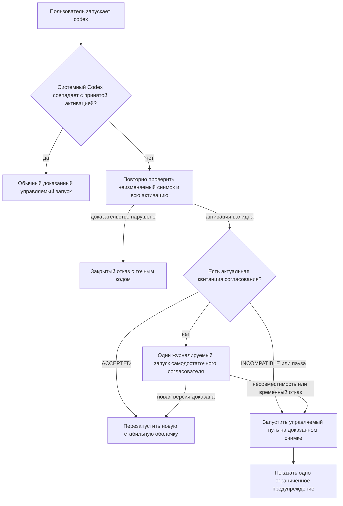

# Проект самовосстановления после обновления Codex

## Состояние документа

Проект подтверждён владельцем 31 июля 2026 года. Он уточняет жизненный цикл
адаптивных субагентов версии 2 после фактического сбоя обновления
`codex-cli 0.145.0 -> 0.146.0`. Этот документ описывает требуемое поведение,
но сам по себе не является доказательством реализации.

## Наблюдавшийся сбой

После замены Homebrew-двоичного файла обычная команда `codex` завершилась
сообщением `codex-smart: SOURCE_CHANGED; используйте codex-native`.
Диагностика установила три независимые причины:

1. принятая активация была связана с точным путём и отпечатком Codex
   `0.145.0`, поэтому проверка справедливо обнаружила замену файла;
2. установщик допускал только вручную перечисленные версии до `0.145.0` и
   отказался проверять возможности стабильной версии `0.146.0`;
3. живой `model/list` возвращал корректный каталог, но строгий клиент
   отвергал ответ из-за известного неблокирующего сообщения журнала, а новый
   временный каталог SQLite не успевал инициализироваться в установленный
   срок.

Фактические проверки `0.146.0` подтвердили наличие команд
`debug models --bundled`, `app-server`, `exec`, метода `model/list`, моделей
Luna, Terra и Sol и требуемых уровней рассуждений.

## Цель

Обновление системного Codex не должно лишать пользователя обычной команды
`codex` или умной маршрутизации. Совместимая стабильная версия должна
приниматься без изменения исходного кода ради нового номера. Несовместимая
или временно непроверяемая версия не должна заменять последний доказанный
управляемый контур.

Практическая гарантия формулируется так:

- текущий системный Codex используется нативными входами;
- управляемый вход использует текущий Codex только после проверки его
  возможностей;
- до успешного принятия новой версии управляемый вход продолжает работу на
  последнем доказанном неизменяемом снимке;
- повтор любого завершённого действия не создаёт новой активации и возвращает
  неизменившееся состояние.

Невозможно гарантировать работу адаптивных функций на произвольной будущей
версии, удалившей необходимые интерфейсы. В таком случае гарантируется не
ложная совместимость, а доступность последнего проверенного снимка и нативного
текущего Codex.

## Не входит в работу

- изменение правил выбора Luna, Terra и Sol;
- добавление новых псевдонимов или фонового системного демона;
- изменение способа обновления Homebrew;
- исправление посторонних процессов `node_repl`, браузерных средств или
  сетевого подключения;
- ослабление проверки манифеста, активации, базы, квитанций либо снимка.

## Архитектура

### 1. Допуск по возможностям вместо списка номеров

Проверка номера разрешает каноническую стабильную версию не ниже
`minimum_codex_version`. Предварительные выпуски и некорректные номера
по-прежнему отвергаются.

Сам номер только допускает кандидата к проверке. Активация требует уже
существующие доказательства возможностей:

- корректный ответ `--version`;
- закрытый каталог `debug models --bundled`;
- обязательные параметры `app-server --help` и `exec --help`;
- совместимость машинных схем и политики маршрутизации;
- живой каталог учётной записи через один сеанс `model/list`;
- наличие допустимой пары корневого координатора.

Таким образом, следующая стабильная версия с теми же интерфейсами не требует
правки списка, а ломающая версия не попадает в активный контур.

### 2. Непрерывность через доказанный снимок

`ActivationResolver` различает повреждение принятой активации и замену только
внешнего системного двоичного файла. Если манифест, квитанция, база,
контроллер, каталог, доказательство интерфейса и неизменяемый снимок валидны,
то расхождение внешнего источника не переводит активацию в `ORDINARY`.

Вместо этого возвращается состояние `READY` с исполняемым файлом принятого
снимка и отдельным признаком `source_drift`. Снимок повторно проверяется по
пути, режиму, владельцу, отпечатку, архитектуре и доказательству интерфейса.
Любое иное расхождение остаётся закрытым отказом.

Нативные входы `codex-native`, служебные подкоманды и ранний корневой
`ultra` продолжают использовать текущий системный Codex.

### 3. Самодостаточный согласователь

Каждая новая активация содержит минимальную неизменяемую капсулу
согласования: установочный сценарий и все исходные договоры, необходимые для
проверки и создания следующей активации. Капсула входит в отпечаток дерева и
не зависит от наличия исходной рабочей копии репозитория.

При `source_drift` оболочка выполняет один ограниченный вызов согласователя из
текущей принятой активации под существующей установочной блокировкой:

1. вычисляет личность нового системного двоичного файла;
2. проверяет, не существует ли уже результата для той же личности;
3. запускает обычную журналируемую операцию обновления;
4. при успехе один раз перезапускает стабильную оболочку с защитным маркером
   от рекурсии;
5. при отказе продолжает текущий запуск на доказанном снимке.

Согласователь не изменяет Homebrew-файл и не объявляет совместимость до
завершения существующего атомарного перехода активации.

### 4. Квитанция попытки согласования

В частном каталоге состояния хранится закрытый документ, связанный с:

- абсолютным и разрешённым путём системного Codex;
- его SHA-256;
- выпуском и активацией согласователя;
- исходом `ACCEPTED`, `INCOMPATIBLE` либо `RETRY_AFTER`;
- нормализованным кодом причины;
- отпечатком всего документа.

`ACCEPTED` подтверждается новым активным манифестом. `INCOMPATIBLE` не
повторяется до смены двоичного файла или выпуска согласователя.
`RETRY_AFTER` задаёт ограниченную паузу после временного отказа. Изменённая,
повреждённая или не принадлежащая пользователю квитанция игнорируется как
доказательство и не может разрешить активацию.

### 5. Устойчивое чтение каталога моделей

Инспектор `model/list` использует существующее состояние SQLite Codex, как
уже делает инспектор управляемых требований. Это устраняет полное повторное
построение временных баз при каждом выборе координатора.

Поток ошибок сервера приложений остаётся ограниченным. Разрешаются не более
четырёх строк уже известного точного сообщения
`codex_models_manager::manager: failed to refresh available models: timeout waiting for child process to exit`.
Допустимость этой строки не заменяет проверку ответа: `model/list` всё равно
должен вернуть корректный закрытый каталог. Любое другое сообщение, неполная
строка, превышение размера, неожиданный ответ или выход процесса остаются
ошибкой.

## Полный поток

## Ошибки и восстановление

- Прерывание до записи намерения не оставляет нового состояния.
- Прерывание после записи намерения продолжается существующей командой
  восстановления установщика.
- Прерывание после публикации активации согласуется по квитанциям без второго
  перехода.
- Занятая блокировка не запускает параллельное обновление; текущий разговор
  использует доказанный снимок.
- Несовместимая версия не удаляет предыдущую активацию и не меняет нативный
  путь.
- Повреждённый снимок не заменяется внешним изменившимся файлом.
- Защитный маркер допускает не более одного повторного запуска оболочки на
  один пользовательский вызов.

## Идемпотентность и параллельность

Личность операции выводится из установки, текущей активации, отпечатка нового
Codex и исходного дерева согласователя. Одинаковые входы дают одну операцию.
Установочная блокировка сериализует параллельные терминалы, а журналы и
квитанции различают подготовленное, принятое и уже согласованное состояние.

После успешного обновления:

- повторный запуск согласователя ничего не меняет;
- повторный `--apply` возвращает `unchanged`;
- обычный `codex` больше не видит `source_drift`;
- локальный и принятый отпечатки нового Codex совпадают.

## Проверки приёмки

1. Обновление `0.145.0 -> 0.146.0` автоматически создаёт одну новую
   активацию и восстанавливает обычный `codex`.
2. Повторное применение возвращает `unchanged`.
3. Стабильный будущий номер с совместимыми поддельными интерфейсами проходит
   без изменения списка версий.
4. Предварительный выпуск и версия ниже минимума отвергаются до эффектов.
5. Ломающий кандидат оставляет управляемый запуск на старом снимке, а
   нативный вход — на новом системном Codex.
6. Каждый существенный момент прерывания восстанавливается без второй
   активации.
7. Параллельные терминалы создают не более одной операции обновления.
8. Точное известное сообщение обновления каталога допускается только вместе
   с корректным `model/list`; изменённое сообщение отвергается.
9. Инспектор не создаёт новую временную SQLite-базу для чтения каталога.
10. Повреждение манифеста, базы, квитанции или снимка по-прежнему закрывает
    управляемый путь.
11. Живой `0.146.0` подтверждает Sol medium, запас Terra medium и нативный
    ранний Ultra.
12. Полный набор качества, диагностика, дымовая проверка и проверка ссылок
    проходят после установленного обновления.

## Откат

Откат использует существующий журналируемый жизненный цикл. До принятия новой
активации достаточно удалить только незавершённую попытку через восстановление.
После принятия предыдущая активация и снимок остаются привязанными к
квитанциям и могут быть восстановлены штатной командой отката. Квитанция
автосогласования не является основанием для удаления снимков или данных.
