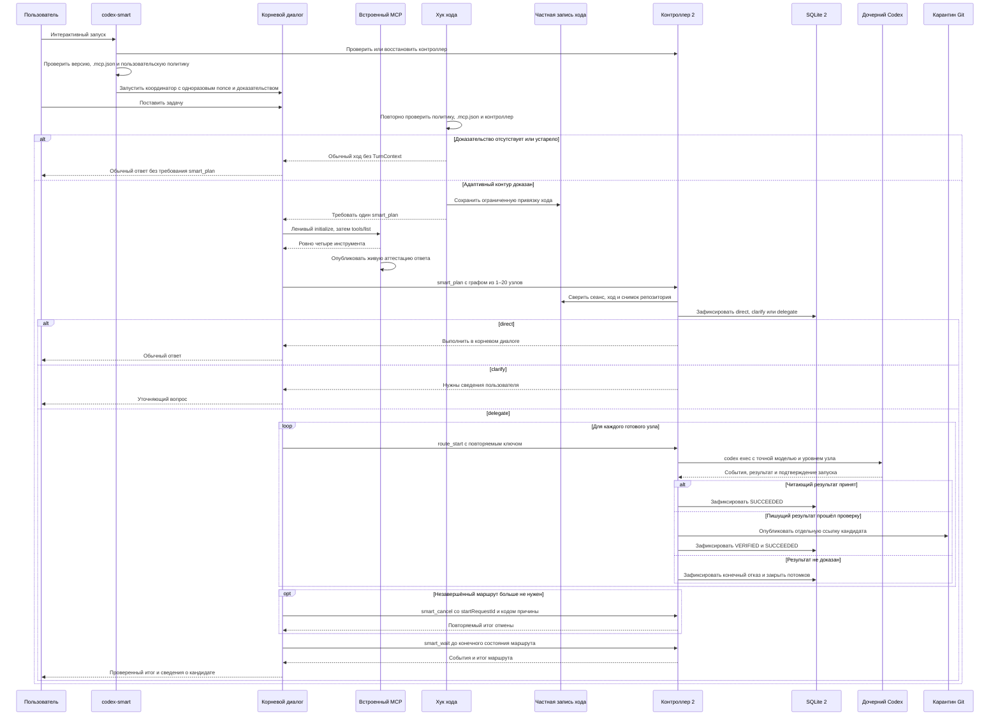
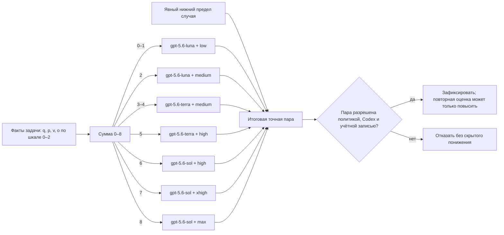

# Адаптивные субагенты Codex

Расширение версии `0.2.0` оставляет основной диалог координатором, а
независимые проверяемые подзадачи передаёт отдельным процессам `codex exec`.
Контроллер выбирает для каждого субагента модель, уровень рассуждения и
читающий либо пишущий профиль. Пишущий результат остаётся отдельным кандидатом
Git и никогда не применяется к исходной рабочей копии автоматически.
Этот документ описывает предусмотренный пользовательский путь. Живые
доказательства опубликованы в
[итоговом отчёте](../../docs/analysis/2026-07-20-adaptive-subagents-v2-validation.md).

## Быстрый старт

Из корня репозитория сначала посмотреть план установки:

```bash
codex --version
python3 scripts/install_adaptive_subagents.py --json
```

Применить установку и сначала прочитать состояние диагностики:

```bash
python3 scripts/install_adaptive_subagents.py --apply --json
python3 scripts/install_adaptive_subagents.py --doctor --json
```

Если диагностика вернула `readiness=AWAITING_HOOK_TRUST`, запустить новую
сессию, открыть `/hooks`, проверить источник
`codex-smart-subagents@codex-settings-adaptive` и ровно две записи
`UserPromptSubmit` и `Stop`, затем принять решение о доверии вручную:

```bash
~/.local/bin/codex-smart
# в открывшейся сессии: /hooks
```

После принятия решения завершить эту сессию и запустить проверки повторно:

```bash
python3 scripts/install_adaptive_subagents.py --doctor --json
python3 scripts/install_adaptive_subagents.py --smoke --json
```

К следующему шагу переходить только при фактическом `readiness=READY` и
успешной дымовой проверке. В чистом тестовом репозитории запустить новый
диалог через `~/.local/bin/codex-smart` и дать ему первую независимую читающую
подзадачу. Из результата `smart_plan` или итогового результата умного хода
сохранить `routeId`, затем проверить агрегатное состояние и этот маршрут:

```bash
~/.local/bin/codex-smart-subagents-admin status
~/.local/bin/codex-smart-subagents-admin inspect ROUTE_ID --limit 100
```

`status` показывает счётчики и не перечисляет `routeId`. В `inspect` сверить
состояние маршрута, поля `model` и `reasoningEffort` каждого узла, попытки,
события и кандидаты. Состояние кандидата `VERIFIED` не применяет, не сливает и
не отправляет его автоматически.

`inspect` не возвращает зависимости графа: их нужно сохранить из ответа
`smart_plan`. Итоговое поле `terminalResult` возвращает `smart_wait`, а не
административная команда.

Команда `codex` не заменяется и продолжает запускать обычный Codex. Подробные
предварительные условия, значения административных команд и восстановление
описаны в [операционной инструкции](../../docs/runbooks/adaptive-subagents-v2-operations.md).

## Карта руководства

- [Полный поток запроса](../../docs/analysis/adaptive-subagents-v2-flow.md#полный-поток-запроса) показывает
  планирование графа, выбор пары каждому узлу и возврат итога.
- [Поток пишущего результата](../../docs/analysis/adaptive-subagents-v2-flow.md#поток-пишущего-результата)
  объясняет карантин и почему кандидат не применяется сам.
- [Жизненный цикл установки](../../docs/analysis/adaptive-subagents-v2-flow.md#обновление-откат-и-удаление-установки) показывает
  повторяемое обновление, откат, удаление и возобновление журнала.
- [Восстановление установщика](../../docs/analysis/adaptive-subagents-v2-flow.md#восстановление-установщика-после-прерывания)
  продолжает точную установочную операцию по её журналу.
- [Восстановление временного процесса](../../docs/analysis/adaptive-subagents-v2-flow.md#восстановление-временного-процесса-установщика)
  показывает долговечную запись личности, закрытый шлюз до внешних эффектов
  и конечный исход после аварии: доказанное снятие либо закрытый блокирующий
  отказ.
- [Поток восстановления маршрута](../../docs/analysis/adaptive-subagents-v2-flow.md#восстановление-маршрута-после-прерывания) показывает,
  как перед изменениями сверяются процессы, каталоги и кандидаты.
- [Итоговый отчёт живой проверки](../../docs/analysis/2026-07-20-adaptive-subagents-v2-validation.md)
  фиксирует проверенную дату, чистую копию Git, маршрут, узел, попытку,
  выбранную и фактически наблюдённую пару.
- [Корневая модель и роль `AGENTS.md`](#корневая-модель-и-роль-agentsmd) разделяет
  подсказку о делегировании и проверяемую маршрутизацию версии 2.

## Как проходит умный ход



Адаптивный режим включается только при одновременном доказательстве
неизменяемого `.mcp.json`, неослабляющей пользовательской политики, точного
ответа `tools/list`, живого процесса встроенного MCP и готового контроллера.
Доказательство связано с одноразовым nonce конкретного запуска. Codex может
запустить MCP лениво уже после `UserPromptSubmit`, поэтому обработчик запроса
до сохранения `TurnContext` проверяет пользовательскую политику, встроенный
договор и контроллер, но не ждёт ещё не созданную живую аттестацию. При первом
обращении к инструментам MCP возвращает точный `tools/list`, публикует
аттестацию и только затем принимает `smart_plan`. Реальное изменение целевой
политики или договора закрывает адаптивный ход; несвязанная перезапись
`config.toml`, например сохранение состояния доверия обработчиков, его не
отключает. Если ленивый MCP всё же недоступен, `Stop` ограничивает повторное
напоминание двумя попытками и разрешает завершение без бесконечного цикла.

Для каждого доказанного пользовательского хода `UserPromptSubmit` сохраняет
ограниченный контекст, после чего основной диалог обязан один раз вызвать
`smart_plan`.
Публичный `smart_plan` принимает закрытый список `nodes` от одного до двадцати
элементов. Каждый элемент содержит только `clientNodeId`, `dependencyIds` и
собственный `routingInput`. Контроллер проверяет отсутствие циклов, не более
60 связей, глубину не более 4 и правило единственного пишущего узла: он должен
быть конечным и зависеть прямо либо косвенно от всех читающих узлов.

Публичный `routingInput` содержит только `taskFacts`, `contextBundle` и
`roleTemplateId`. Корневой диалог передаёт миссию, доказуемые оценки `q/p/v/o`,
проверяемость, независимые единицы и флаги риска. Версии внутреннего договора,
фаза, разрешение делегирования, каталоги доступности, сведения попытки и режим
повторной оценки добавляются контроллером до единственного вызова
маршрутизатора. Нормативные критерии и пороги встроены в описание схемы
`smart_plan`, доступное через `tools/list`; неизвестные значения оцениваются по
консервативной верхней границе.

Модель и уровень рассуждения выбираются отдельно для каждого узла по его
смысловым признакам. Поэтому один маршрут может, например, отдать простое
чтение Luna, проверку Terra, а итоговый синтез Sol. Смешанный план не
исполняется частично: если хотя бы один узел требует уточнения, весь маршрут
получает `clarify`; если не все узлы допускают делегирование, весь маршрут
получает `direct`. Только полностью делегируемый граф получает `delegate`.

Результат планирования имеет один из трёх смыслов:

- `direct` — выполнить задачу в основном диалоге без субагента;
- `clarify` — сначала получить недостающие сведения у пользователя;
- `delegate` — запускать готовые узлы через `route_start` в порядке
  зависимостей.

Основной диалог читает ограниченные страницы событий через `smart_wait`.
Узел можно запустить только после успешного завершения всех его зависимостей.
Их результаты передаются потомку в ограниченной проекции с размером и
отпечатками исходного и сокращённого представления. Обычный отказ узла либо
его аварийное восстановление закрывает ещё не запущенных потомков, поэтому
зависший граф не остаётся внешне выполнимым.

После завершения маршрута основной диалог получает проверенный итог. Небольшой
результат передаётся прямо, а размер и отпечаток полного результата позволяют
проверить повторное чтение. Повтор `smart_plan` с тем же ключом возвращает тот
же маршрут, а повтор `route_start` — ту же квитанцию запуска, а не нового
субагента.

Четвёртый инструмент, `smart_cancel`, повторяемо запрашивает отмену ещё не
завершённого запуска по его `startRequestId`. Код `USER_REQUESTED` означает
явную отмену пользователем, `TURN_ENDED` — завершение связанного хода, а
`ROUTE_SUPERSEDED` — замену маршрута новым. Это инструмент умного хода, а не
административная команда `cancel`: такой команды в административной оболочке
версии 2 нет.

## Как решается, нужен ли субагент

Маршрутизация выполняется в две ступени. Сначала контроллер принимает решение
`clarify`, `direct` или `delegate`. Для `delegate` одновременно требуются:

- явное разрешение делегирования;
- хотя бы одна независимая единица работы;
- объективно проверяемый результат;
- отсутствие причины, которая требует решения владельца, уточнения либо
  обычного выполнения.

Конфликт полномочий, обязательное решение владельца или недоступный необходимый
факт дают `clarify`. Явный запрет делегирования, отсутствие явного разрешения,
непроверяемый результат или отсутствие независимой единицы дают `direct`.
Только после решения `delegate` вычисляется точная пара модели и уровня.

## Как выбираются модель и уровень рассуждения



Для делегированного узла четыре оценки означают:

- `q` — сложность цепочки рассуждений и согласования ограничений;
- `p` — объём работы, число границ и независимых потоков;
- `v` — цена ошибки и требуемая доказательность отката;
- `o` — неопределённость и изменчивость исходных сведений.

Каждая оценка принимает значение от `0` до `2`. Пропущенный или неизвестный
критерий не считается нулём. Точное соответствие суммы:

| Сумма | Модель субагента | Уровень рассуждения |
|---:|---|---|
| `0–1` | `gpt-5.6-luna` | `low` |
| `2` | `gpt-5.6-luna` | `medium` |
| `3–4` | `gpt-5.6-terra` | `medium` |
| `5` | `gpt-5.6-terra` | `high` |
| `6` | `gpt-5.6-sol` | `high` |
| `7` | `gpt-5.6-sol` | `xhigh` |
| `8` | `gpt-5.6-sol` | `max` |

Нижний предел может повысить пару независимо от суммы. Архитектурное решение,
публичный договор и рискованная миграция требуют не ниже Terra. Необратимое
действие, недоказанный откат и явно отмеченная окончательная авторская проверка
перед публикацией требуют Sol. Само имя роли не заменяет смысловую оценку:
пишущий узел получает точную пару по тем же доказанным факторам и нижним
пределам.

Если нужной пары нет одновременно в политике, снимке установленного Codex и
свежем каталоге учётной записи, контроллер отказывает в запуске. Он не заменяет
Sol на Terra или Terra на Luna молча. Повторная оценка уже выбранной пары может
только повысить её.

## Облегчённый вариант через AGENTS.md

Если проверяемая маршрутизация, журналы и аварийное восстановление не нужны,
можно ограничиться следующим блоком в корневом `AGENTS.md` проекта:

```markdown
Для независимых подзадач используй субагентов, когда это улучшает качество или
сокращает время работы. Перед каждым делегированием отдельно оцени сложность
подзадачи и необходимый уровень рассуждения: простые задачи направляй на Luna,
обычные инженерные задачи — на Terra, сложные архитектурные и проверочные — на
Sol. Выбирай минимальный достаточный уровень рассуждения. Не заменяй молча
недоступную пару «модель — уровень рассуждения»: сообщи об ограничении и
выполни задачу в основном диалоге либо запроси решение пользователя.
```

Это рабочая рекомендация для обычного Codex, а не принудительный механизм.
Она не требует установки этого расширения и подходит проектам, где достаточно
разумного выбора самим агентом. Чтобы закрепить конкретные пары, нужно также
описать пользовательские роли в TOML; один `AGENTS.md` не создаёт такие
профили и не подтверждает, какую модель фактически запустил Codex.

## Корневая модель и роль AGENTS.md

Для поддержанного интерактивного запуска без явной настройки `codex-smart`
добавляет корневому диалогу пару координатора
`gpt-5.6-terra` + `medium`. Если пользователь явно задал модель или
`model_reasoning_effort`, оболочка сохраняет этот выбор. Уже запущенный
корневой диалог не может незаметно переключить собственную модель посреди
хода; адаптация выполняется созданием отдельных дочерних процессов.

Codex собирает применимую цепочку инструкций `AGENTS.md` один раз при
запуске сеанса. В обычном встроенном многоагентном режиме явная инструкция
может попросить Codex делегировать независимую работу. Если в отдельном
TOML-файле роли не закреплены `model` и `model_reasoning_effort`, текущий Codex
может сам подобрать их по задаче; при явной настройке роль использует заданную
пару, а остальные незаданные параметры наследует от родительского сеанса.

Короткая рекомендация в проектном `AGENTS.md`, например «используй субагентов
для независимых проверяемых подзадач», полезна и для обычной команды `codex`.
Но сама по себе она не может:

- доказать, какая модель фактически запущена;
- гарантировать именно принятую в этом проекте шкалу выбора каждой пары;
- запретить скрытую замену недоступной пары на соседнюю;
- обеспечить повторяемость, пределы процессов и восстановление;
- изолировать пишущий результат и опубликовать только проверенного кандидата.

Эти гарантии появляются только в пути `codex-smart`: хук требует
`smart_plan`, контроллер выбирает пару из смысловых фактов конкретного узла, а
дочерний запуск подтверждает фактическую модель и уровень. Поэтому короткой
инструкции в `AGENTS.md` достаточно для эвристического встроенного выбора, но
не для доказуемой маршрутизации и восстановления версии 2.

Справочная документация Codex:
[проектные инструкции AGENTS.md](https://learn.chatgpt.com/docs/agent-configuration/agents-md)
и [настройка субагентов](https://learn.chatgpt.com/docs/agent-configuration/subagents).

## Чтение, запись и возврат результата

Читающий узел получает зафиксированный снимок исходного репозитория и
отдельные временные каталоги. Его структурированный результат принимается
только после проверки формата и подтверждения фактического дочернего запуска.

Пишущий узел работает не в исходной рабочей копии, а в отдельном рабочем
пространстве кандидата. Порядок публикации таков:

1. зафиксировать исходный снимок и создать изолированную рабочую область;
2. получить структурированный результат дочернего процесса;
3. построить объекты кандидата без изменения исходного репозитория;
4. материализовать кандидат и выполнить назначенные проверки;
5. повторно сверить исходный репозиторий;
6. записать намерение публикации в SQLite;
7. последним действием создать отдельную ссылку в карантине Git;
8. сверить ссылку, дерево и родителя и только затем отметить кандидат
   проверенным.

Если любой обязательный шаг не доказан, результат получает состояние
`QUARANTINED`. Даже состояние `VERIFIED` не означает автоматическое
применение, слияние или отправку изменений во внешний репозиторий.

`CANDIDATE_READY` сохраняется в полном договоре состояний и при переносе ранее
записанных маршрутов. Текущий производственный путь успешного пишущего узла
завершает его попытку как `SUCCEEDED`, а публикацию кандидата отдельно как
`VERIFIED`. Эти состояния проверяются раздельно.

## Прерывание и восстановление

### Восстановление маршрута

Состояние маршрутов, попыток, разрешений запуска, временных областей и
публикаций хранится в SQLite. При запуске контроллер сначала строит единый
план восстановления для всех этих областей. До первых изменений он проверяет
весь исходный план: неизвестный процесс, каталог или ссылка кандидата блокирует
начальное применение вместо частичной догадки.

Для живого остаточного процесса должны совпасть идентификатор и маркер начала
процесса. Только доказанная группа завершается, после чего проверяется её
отсутствие и состояния попытки, узла и маршрута переводятся в конечные.
Каталог удаляется только при совпадении пути, владельца, режима, маркера,
устройства и номера файлового объекта. Ссылка кандидата восстанавливается как
точная, отсутствующая либо несовпадающая; кандидат при этом не применяется к
исходной рабочей копии.

Операторский порядок после прерывания:

```bash
~/.local/bin/codex-smart-subagents-admin status
~/.local/bin/codex-smart-subagents-admin doctor
~/.local/bin/codex-smart-subagents-admin stop
~/.local/bin/codex-smart-subagents-admin recover --dry-run
```

`stop` дважды доказывает точную личность контроллера по идентификатору и
маркеру начала процесса, посылает сигнал только ему и ограниченно ждёт
исчезновения. Повтор при уже отсутствующем контроллере безопасен. После этого,
если пробный план не содержит блокирующих неизвестных объектов, его можно
применить:

```bash
~/.local/bin/codex-smart-subagents-admin recover --apply
```

Команда `--apply` отказывается работать при живом контроллере. Не следует
выбирать процесс через `pgrep` или посылать ручной сигнал по недоказанному
идентификатору: для этого предусмотрен `stop`. Восстановление не сливает и не
применяет карантинные кандидаты. Подробная схема окон прерывания находится в
[диаграммах потока и восстановления](../../docs/analysis/adaptive-subagents-v2-flow.md).

### Восстановление установщика

Прерванную установку, обновление, откат или удаление продолжает сам установщик
по своему журналу. Сначала прочитать состояние и пробный план, затем применять
только совпавшее намерение:

```bash
python3 scripts/install_adaptive_subagents.py --inspect --json
python3 scripts/install_adaptive_subagents.py --recover --preview --json
python3 scripts/install_adaptive_subagents.py --recover --apply --json
```

Эти команды не заменяются административным `recover`: тот работает с
маршрутами, дочерними процессами, временными областями и кандидатами Git.
Для незавершённого удаления `--recover --preview --json` распознаёт его журнал
без изменений: `extensions.lifecycleAdapter.journalKind=uninstall`, а
сохранённый идентификатор находится в
`extensions.lifecycleAdapter.internalOperationId`. Верхнее поле `operationId`
при просмотре остаётся пустым. `--recover --apply --json` продолжает тот же
`operationId` и возвращает его после завершения. Равнозначный точный путь —
повтор команды
`--uninstall --retain-data --apply --json`: оба входа используют один журнал и
не создают второе удаление. Прерванная уборка остаётся отдельной операцией и
продолжается только повтором `--cleanup --apply --json`.

## Установка и повторный запуск

Установщик требует проверенную стабильную версию Codex: `0.144.4`, `0.144.5`,
`0.144.6` или `0.145.0`, а также Python не ниже `3.11`. Неизвестный будущий Codex
запускается в обычном режиме до отдельной проверки совместимости. Рабочая
активация не требует внешних пакетов Python: проверка закрытого подмножества
JSON Schema входит в исходники. Пакеты `jsonschema` и `referencing` нужны
только контуру разработки и не копируются в активацию. При каждом запуске
установщик заново проверяет версию, исполняемый файл и договоры возможностей.
Пути можно переопределить
параметрами `--codex-home`, `--bin-dir`, `--state-home` и `--codex-binary`;
обычная установка использует текущий профиль Codex, `~/.local/bin` и каталог
состояния внутри профиля.

Первый `--apply` создаёт принятую активацию, две стабильные ссылки
`codex-smart` и `codex-smart-subagents-admin`, регистрирует локальный рынок и
расширение штатными командами Codex и записывает квитанцию установщика.

Точный повтор той же команды является проверкой идемпотентности:

```bash
python3 scripts/install_adaptive_subagents.py --apply --json
```

Если квитанция, отпечаток входов установки, пути, регистрация и активация
совпадают, результат имеет `status=unchanged`; контроллер при необходимости
восстанавливается. В `sourceDigest` входят исходники, лексический путь и
содержимое выбранного Codex, а также канонический путь и содержимое Python,
которым запущен установщик. Изменение любой из этих частей запускает тем же
`--apply` журналируемое обновление.
Неизвестное владение путями либо противоречивое состояние по-прежнему закрывает
операцию.

`--doctor` проверяет квитанцию, активную привязку, стабильные ссылки,
регистрацию рынка и расширения, а также доступность командного сокета.
`--smoke` разрешён только при `readiness=READY` и проверяет запуск установленной
оболочки через безопасную команду `--version`; пользовательская задача и
модели при этом не запускаются.

Полный жизненный цикл управляется этим же установщиком, а не
административной командой маршрутов:

```bash
python3 scripts/install_adaptive_subagents.py --rollback --preview --json
python3 scripts/install_adaptive_subagents.py --rollback --apply --json
python3 scripts/install_adaptive_subagents.py --uninstall --retain-data --preview --json
python3 scripts/install_adaptive_subagents.py --uninstall --retain-data --apply --json
python3 scripts/install_adaptive_subagents.py --recover --preview --json
python3 scripts/install_adaptive_subagents.py --recover --apply --json
python3 scripts/install_adaptive_subagents.py --cleanup --preview --json
python3 scripts/install_adaptive_subagents.py --cleanup --apply --json
python3 scripts/install_adaptive_subagents.py --inspect --json
```

Откат публикует только целую предыдущую активацию. Удаление обязательно
сохраняет пользовательские данные; разрушительный вариант в выпуске 0.2
отсутствует. `recover` продолжает доказанное намерение установки, обновления,
отката или удаления. Для журнала удаления просмотр показывает
`extensions.lifecycleAdapter.journalKind=uninstall`, а сохранённый идентификатор
— в `extensions.lifecycleAdapter.internalOperationId`; применение продолжает
тот же `operationId` без новой операции. Точный повтор
`--uninstall --retain-data --apply --json` приводит к тому же журналу.
`cleanup` касается только больше не используемых поколений, не удаляет старые
commit-квитанции и после прерывания продолжается повтором
`--cleanup --apply --json`. Для изменяющих команд обязателен ровно один из
флагов `--preview` и `--apply`.

## Управление

Версия 2 предоставляет пять административных команд:

```bash
~/.local/bin/codex-smart-subagents-admin status
~/.local/bin/codex-smart-subagents-admin doctor
~/.local/bin/codex-smart-subagents-admin inspect route2_0123456789abcdef0123456789abcdef
~/.local/bin/codex-smart-subagents-admin stop
~/.local/bin/codex-smart-subagents-admin recover --dry-run
```

- `status` показывает привязку активации, жив ли контроллер, и счётчики
  состояний маршрутов, попыток и временных областей, но не список `routeId`;
- `doctor` проверяет состояние восстановления и доступность контроллера;
- `inspect` читает один маршрут, его узлы, попытки, события, временные области
  и кандидаты; необязательный `--limit` принимает значение от `1` до `200`;
- `stop` доказательно и повторяемо останавливает только принятый контроллер;
- `recover --dry-run` ничего не меняет, а `recover --apply` применяет только
  доказанный план при остановленном контроллере.

Вывод всегда является одним объектом JSON со `schemaVersion=2`, кодом,
сообщением и данными. Команды старой версии `explain`, `report`, `metrics`,
`cleanup`, `cancel` и `rollback` не входят в административный интерфейс
версии 2.

## Ограничения

- Адаптивный путь применяется только к поддержанному интерактивному запуску
  `codex-smart`; подкоманды и неизвестные параметры выполняются обычным Codex.
- Корневая модель не переключается во время уже начатого диалога.
- Каталог задаёт максимум 20 внешних процессов, 6 процессов одного маршрута и
  2 процесса Sol одновременно.
- Нужная пара модели и уровня должна быть доступна фактически; скрытого
  понижения нет.
- Кандидат не применяется, не сливается и не отправляется автоматически.
- `recover --apply` требует уже остановленного контроллера; штатный порядок —
  `stop`, `recover --dry-run`, затем `recover --apply`.
- Неизвестное состояние приводит к явному отказу, а не к догадке.

## Связанные документы

- [Центральный каталог](../../README.md);
- [операционная инструкция](../../docs/runbooks/adaptive-subagents-v2-operations.md);
- [диаграммы запроса, публикации и восстановления](../../docs/analysis/adaptive-subagents-v2-flow.md);
- [итоговый отчёт живой проверки](../../docs/analysis/2026-07-20-adaptive-subagents-v2-validation.md);
- [исторический дизайн совместимости и жизненного цикла](../../docs/plans/2026-07-17-codex-capability-compatibility-idempotent-lifecycle-design.md);
- [договор жизненного цикла версии 2](../../docs/contracts/adaptive-subagents-lifecycle-v2.md);
- [договор состояния SQLite версии 2](../../docs/contracts/adaptive-subagents-state-v2.md);
- [переход со старого процесса](../../docs/migrations/adaptive-subagents-v2.md);
- [архитектурное решение](../../docs/decisions/001-adaptive-subagents-external-controller.md).
