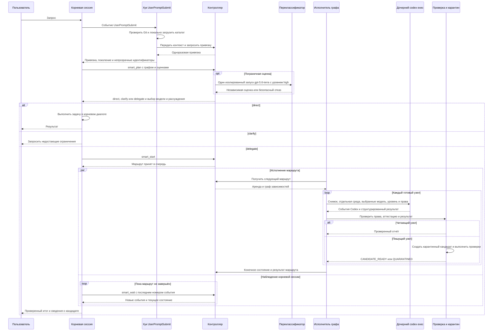
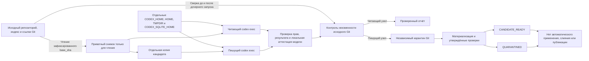

# Адаптивные субагенты Codex

Расширение оставляет корневой диалог координатором и передаёт проверяемые
подзадачи отдельным процессам `codex exec`. Контроллер детерминированно выбирает
модель, уровень рассуждения и профиль прав, а результат автора помещает в
отдельный карантин Git без применения к исходному репозиторию.

Первая версия предоставляет ровно четыре инструмента MCP:

- `smart_plan`;
- `smart_start`;
- `smart_wait`;
- `smart_cancel`.

Инструмента применения или слияния кандидата нет.

## Оглавление

- [Как проходит умный ход](#как-проходит-умный-ход)
- [Изоляция чтения и записи](#изоляция-чтения-и-записи)
- [Неподвижные границы](#неподвижные-границы)
- [Установка](#установка)
- [Управление](#управление)
- [Откат](#откат)
- [Связанные документы](#связанные-документы)

## Как проходит умный ход



Корневая модель не переключается внутри уже начатого диалога. Событие
`UserPromptSubmit` выдаёт одноразовую привязку хода и требует ровно один
`smart_plan`. Публичная схема инструмента определяет шкалу `0/1/2`, факторы
делегирования, сложности и рассуждения, роли и ограничения графа.
Хук загружает каталог локально и передаёт корневой сессии его поколение и
непрозрачные идентификаторы; контроллер возвращает хуку только одноразовую
привязку. Если поколение уже не активно, `smart_plan` отвечает безопасным
отказом `CATALOG_STALE`.

Контроллер сверяет непрозрачные идентификаторы с активным каталогом и сам
выбирает пару «модель — уровень рассуждения»:

- простые читающие задачи начинаются с `gpt-5.6-luna`;
- задачи средней сложности и риска повышаются до `gpt-5.6-terra`;
- сложные, критичные и пишущие задачи повышаются до `gpt-5.6-sol`;
- автор всегда получает не ниже `gpt-5.6-sol` с уровнем `high`;
- понижение при недоступности модели запрещено, разрешено только повышение.

Неопределённая граница делегирования получает ровно одну независимую
переклассификацию на `gpt-5.6-terra` с уровнем `high`. Повтор точного
`smart_plan` возвращает тот же маршрут без повторного модельного вызова, а
другая попытка использовать ту же привязку хода отклоняется до внешнего
запуска.

Глобально допускается не более 20 внешних рабочих процессов, не более 6
процессов одного маршрута или пограничной переклассификации и не более 2
процессов Sol. При доступной Terra контроллер оставляет шесть мест для
пограничной оценки и одновременно исполняет не более двух маршрутов.

Фактические модель, уровень рассуждения, версия Codex и идентификатор диалога
подтверждаются локальной телеметрией. До каждого дочернего запуска выполняются
проверка ресурсов и отрицательная проверка профиля прав.

Одноразовый токен локального приёмника передаётся только через
`OTEL_EXPORTER_OTLP_LOGS_HEADERS` с процентным кодированием. Он отсутствует в
аргументах процесса и в среде команд, доступных модели. Контроль файлов
допускает только три штатные временные ссылки Codex 0.144.4
(`apply_patch`, `applypatch`, `codex-execve-wrapper`) в точном приватном
каталоге `CODEX_HOME/tmp/arg0/codex-arg0XXXXXX` и только на запущенный
исполняемый файл Codex; любая иная ссылка блокирует процесс.

## Изоляция чтения и записи



## Неподвижные границы

- модель уже работающей корневой сессии автоматически не переключается;
- проверенный кандидат никогда не применяется, не сливается и не публикуется
  автоматически;
- неизвестная версия, модель, профиль прав, идентификатор каталога или
  неподтверждённое состояние приводят к безопасному отказу.

## Установка

Требуется Codex 0.144.4. Поддерживаемые платформы и модели задаются в
`config/adaptive-subagents.toml`. Установщик использует штатные команды
`codex plugin marketplace add` и `codex plugin add`; несуществующая команда
`plugin install` не используется.

Codex 0.144.5 не входит в поддержанный диапазон этой версии расширения. Перед
включением на другой версии требуется отдельная проверка совместимости, а не
изменение номера в каталоге.

Сначала выполнить просмотр действий:

```bash
python3 scripts/install_adaptive_subagents.py
```

Затем, из корня репозитория настроек:

```bash
python3 scripts/install_adaptive_subagents.py --apply --json
python3 scripts/install_adaptive_subagents.py --doctor --json
python3 scripts/install_adaptive_subagents.py --smoke --json
```

Если `--doctor` возвращает `AWAITING_HOOK_TRUST`, открыть `/hooks` в обычной
интерактивной сессии, проверить хук `userPromptSubmit` и хук `stop` именно от
`codex-smart-subagents@codex-settings-adaptive`, затем вручную решить вопрос
доверия. Установщик не меняет доверие сам; `modified` не считается доверенным.
Дымовая проверка запускается только после `status=READY`.

Установка создаёт резервную копию, частный локальный рынок, манифест с
отпечатками, `~/.local/bin/codex-smart` и управляемый
`~/.local/bin/codex-highfd`, а также ссылку
`~/.local/bin/codex-smart-subagents-admin`. Она не меняет корневые `model`,
`model_reasoning_effort`, `sandbox_mode` или `approval_policy`.

Умный режим после установки по умолчанию выключен. Явный пробный запуск:

```bash
CODEX_SMART_ENABLED=1 ~/.local/bin/codex-highfd
```

Без `CODEX_SMART_ENABLED=1` оболочка запускает настоящий Codex напрямую и
сохраняет прежнее поведение.

## Управление

После явного пробного запуска доступны команды:

```bash
codex-smart-subagents-admin status
codex-smart-subagents-admin doctor
codex-smart-subagents-admin inspect ROUTE_ID --limit 100
codex-smart-subagents-admin explain ROUTE_ID
codex-smart-subagents-admin report ROUTE_ID --limit 100
codex-smart-subagents-admin metrics
codex-smart-subagents-admin cancel ROUTE_ID
codex-smart-subagents-admin recover --dry-run
codex-smart-subagents-admin cleanup --dry-run
```

`recover --apply` требует остановленного контроллера, предварительно создаёт
резервную копию базы и не удаляет ссылки Git или карантинные кандидаты.
Команды восстановления и очистки с изменением состояния требуют отдельного
`--apply`.

## Откат

Предварительный просмотр:

```bash
codex-smart-subagents-admin rollback --dry-run
```

Применение:

```bash
codex-smart-subagents-admin rollback --apply
```

Откат проверяет отпечатки до первого удаления, адресно удаляет расширение и
рынок штатными командами Codex, восстанавливает прежний `codex-highfd` либо
удаляет созданный установкой файл. Неизвестные или изменённые артефакты не
удаляются. Перед применением умный режим должен быть выключен, контроллер
остановлен, а активные маршруты и попытки завершены. Резервные копии, база
состояния и карантинные кандидаты сохраняются.

Если установленная административная ссылка недоступна или повреждена, из
проверенной рабочей копии репозитория можно использовать аварийный вход:

```bash
python3 scripts/rollback_adaptive_subagents.py
python3 scripts/rollback_adaptive_subagents.py --apply --json
```

## Связанные документы

- [Центральный каталог](../../README.md);
- [операционная инструкция](../../docs/runbooks/adaptive-subagents-v2-operations.md);
- [переход со старого процесса](../../docs/migrations/adaptive-subagents-v2.md);
- [архитектурное решение](../../docs/decisions/001-adaptive-subagents-external-controller.md);
- [модель угроз](../../docs/threat-models/adaptive-subagents.md);
- [план реализации](../../docs/plans/codex-adaptive-subagents-v2-implementation-plan.md);
- [руководство прежнего автономного процесса](../../docs/guides/autonomous-workflow.md).

Формат локального рынка следует официальной документации:
https://learn.chatgpt.com/docs/build-plugins#build-your-own-curated-plugin-list
